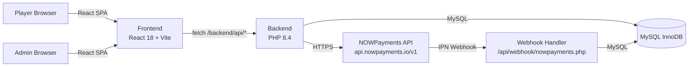
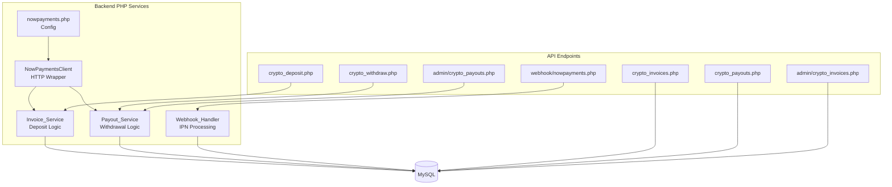
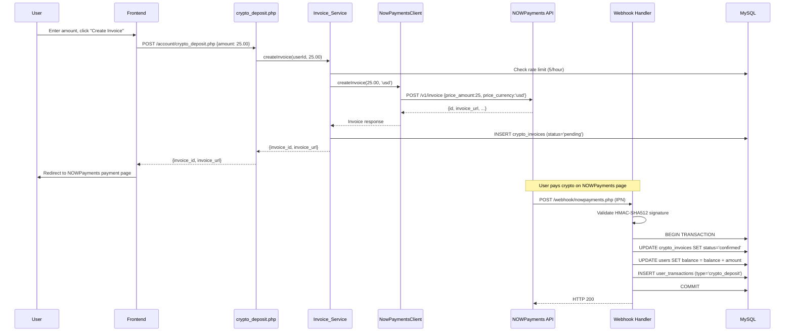
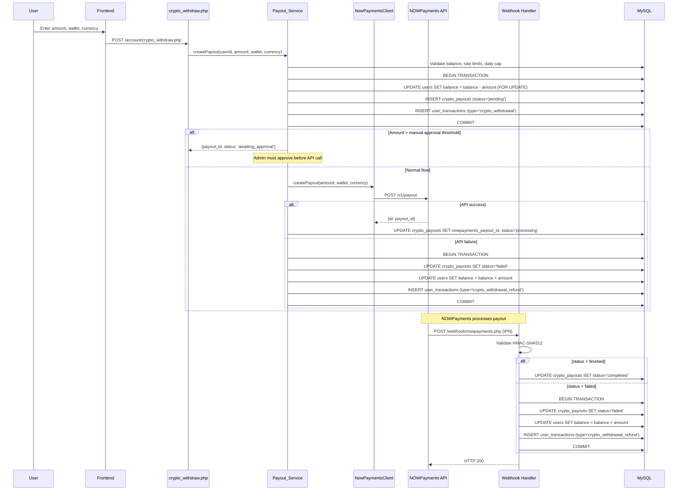

# Design Document — Crypto Payments

## Overview

This design integrates cryptocurrency deposits and withdrawals into the anora.bet lottery platform via the NOWPayments payment gateway. The feature adds two primary flows:

1. **Crypto Deposit**: User creates a USD-denominated invoice → NOWPayments generates a crypto payment page → user pays → NOWPayments sends webhook → system credits `users.balance` and logs to `user_transactions`.
2. **Crypto Withdrawal**: User requests USD withdrawal to a crypto wallet → system deducts balance atomically → calls NOWPayments payout API → webhook confirms or system refunds on failure.

The design follows the existing hybrid balance model: `users.balance` for fast access and `user_transactions` as the append-only audit trail. This is NOT a full ledger replacement — that remains a separate future feature.

All webhook processing is public (no PHP session) but HMAC-SHA512 validated, idempotent, and wrapped in MySQL InnoDB transactions for atomicity.

### Key Design Decisions

| Decision | Rationale |
|---|---|
| Hybrid balance model (`users.balance` + `user_transactions`) | Matches existing deposit/withdrawal/lottery payout pattern; avoids risky ledger migration |
| Webhook endpoint is public, HMAC-validated | NOWPayments IPN callbacks have no session; HMAC-SHA512 with `hash_equals()` prevents forgery and timing attacks |
| Payout creates DB record first, then calls API | If API call fails, we can immediately refund within the same error handler — user funds are never in limbo |
| Manual approval threshold configurable (default $500) | High-value payouts get human review; threshold stored in config for easy adjustment |
| Invoice cleanup via existing cron | Reuses `backend/cron/cleanup.php` — no new cron job needed |
| `NowPaymentsClient` as a standalone class | Centralizes HTTP calls, timeout, headers, error normalization — testable in isolation |

---

## Architecture

### System Context



### Service Layer Architecture



### Request Flow — Crypto Deposit



### Request Flow — Crypto Withdrawal



---

## Components and Interfaces

### 1. `backend/config/nowpayments.php` — Configuration

Returns an associative array:

```php
return [
    'api_key'      => 'YOUR_NOWPAYMENTS_API_KEY',
    'ipn_secret'   => 'YOUR_IPN_SECRET',
    'api_base_url' => 'https://api.nowpayments.io/v1',
    'sandbox_mode' => false,
    'manual_approval_threshold' => 500.00, // USD
];
```

### 2. `backend/includes/nowpayments.php` — NowPaymentsClient

```php
class NowPaymentsClient {
    private string $apiKey;
    private string $baseUrl;
    private int $timeout = 30;

    public function __construct(array $config);

    /** POST /v1/invoice — returns invoice data array */
    public function createInvoice(float $priceAmount, string $priceCurrency = 'usd'): array;

    /** POST /v1/payout — returns payout data array */
    public function createPayout(float $amount, string $address, string $currency): array;

    /** GET /v1/payment/{id} — returns payment status */
    public function getPaymentStatus(string $paymentId): array;

    /**
     * Internal HTTP method. Sets x-api-key header, 30s timeout.
     * Throws NowPaymentsException on non-2xx or network error.
     */
    private function request(string $method, string $endpoint, array $data = []): array;
}

class NowPaymentsException extends \RuntimeException {
    private int $httpStatus;
    private string $responseBody;
    public function __construct(string $message, int $httpStatus = 0, string $responseBody = '');
    public function getHttpStatus(): int;
    public function getResponseBody(): string;
}
```

### 3. `backend/includes/invoice_service.php` — Invoice_Service

```php
class InvoiceService {
    public function __construct(PDO $pdo, NowPaymentsClient $client, array $config);

    /**
     * Create a crypto deposit invoice.
     * Validates amount >= $1.00, rate limit <= 5/hour.
     * Calls NOWPayments API, inserts crypto_invoices row.
     * Returns ['invoice_id' => int, 'invoice_url' => string].
     */
    public function createInvoice(int $userId, float $amountUsd): array;
}
```

### 4. `backend/includes/payout_service.php` — Payout_Service

```php
class PayoutService {
    public function __construct(PDO $pdo, NowPaymentsClient $client, array $config);

    /**
     * Create a crypto withdrawal payout.
     * Validates: amount >= $5, daily cap <= $10k, rate <= 3/day, balance sufficient.
     * Atomic: deducts balance + inserts crypto_payouts + user_transactions.
     * Then calls NOWPayments API (or sets awaiting_approval if above threshold).
     * On API failure: immediate refund within transaction.
     * Returns ['payout_id' => int, 'status' => string, 'message' => string].
     */
    public function createPayout(int $userId, float $amountUsd, string $walletAddress, string $currency): array;

    /**
     * Admin approves a payout — calls NOWPayments API.
     */
    public function approvePayout(int $payoutId): array;

    /**
     * Admin rejects a payout — refunds user balance atomically.
     */
    public function rejectPayout(int $payoutId): array;

    /**
     * Refund a failed payout. Used by webhook handler and API failure path.
     * Atomic: updates status, credits balance, inserts refund transaction.
     */
    public function refundPayout(int $payoutId): void;
}
```

### 5. `backend/includes/webhook_handler.php` — Webhook_Handler

```php
class WebhookHandler {
    public function __construct(PDO $pdo, string $ipnSecret);

    /**
     * Validate HMAC-SHA512 signature.
     * Sorts payload keys recursively, JSON-encodes, computes hash_hmac.
     * Uses hash_equals() for timing-safe comparison.
     */
    public function validateSignature(string $rawBody, string $signatureHeader): bool;

    /**
     * Process an incoming IPN webhook.
     * Routes to deposit or payout handler based on payload structure.
     * Idempotent — safe to receive duplicate webhooks.
     */
    public function handle(string $rawBody, string $signatureHeader): array;

    /** Process deposit webhook (invoice status update). */
    private function handleDeposit(array $payload): array;

    /** Process payout webhook (payout status update). */
    private function handlePayout(array $payload): array;

    /** Recursively sort array keys for HMAC computation. */
    private function sortPayload(array $data): array;
}
```

### 6. API Endpoints

| Endpoint | Method | Auth | Handler |
|---|---|---|---|
| `/api/account/crypto_deposit.php` | POST | `requireLogin()` | `InvoiceService::createInvoice` |
| `/api/account/crypto_withdraw.php` | POST | `requireLogin()` | `PayoutService::createPayout` |
| `/api/account/crypto_invoices.php` | GET | `requireLogin()` | Direct DB query, user-scoped |
| `/api/account/crypto_payouts.php` | GET | `requireLogin()` | Direct DB query, user-scoped |
| `/api/webhook/nowpayments.php` | POST | HMAC-SHA512 | `WebhookHandler::handle` |
| `/api/admin/crypto_invoices.php` | GET | `requireAdmin()` | Direct DB query, all records |
| `/api/admin/crypto_payouts.php` | GET/POST | `requireAdmin()` | GET: list, POST: approve/reject |

### 7. Frontend Components

| Component | Location | Purpose |
|---|---|---|
| `CryptoDepositForm.jsx` | `frontend/src/components/account/` | Amount input, create invoice, show invoice URL/status |
| `CryptoWithdrawForm.jsx` | `frontend/src/components/account/` | Amount/wallet/currency inputs, submit withdrawal |
| `CryptoInvoiceList.jsx` | `frontend/src/components/account/` | User's recent crypto invoices with status badges |
| `CryptoPayoutList.jsx` | `frontend/src/components/account/` | User's recent crypto payouts with status badges |
| `AdminCryptoInvoices.jsx` | `frontend/src/pages/admin/` | Admin paginated table with status filter |
| `AdminCryptoPayouts.jsx` | `frontend/src/pages/admin/` | Admin paginated table with approve/reject actions |

New tabs added to `Account.jsx` TABS array:
- `{ id: 'crypto-deposit', icon: 'currency-bitcoin', label: 'Crypto Deposit' }`
- `{ id: 'crypto-withdraw', icon: 'wallet2', label: 'Crypto Withdraw' }`

New nav entries added to `AdminLayout.jsx`:
- `<NavLink to="/admin/crypto-invoices">Crypto Invoices</NavLink>`
- `<NavLink to="/admin/crypto-payouts">Crypto Payouts</NavLink>`

---

## Data Models

### New Tables

#### `crypto_invoices`

| Column | Type | Constraints | Description |
|---|---|---|---|
| `id` | `INT AUTO_INCREMENT` | `PRIMARY KEY` | Internal invoice ID |
| `user_id` | `INT NOT NULL` | `FK → users.id` | Owner |
| `nowpayments_invoice_id` | `VARCHAR(64)` | `DEFAULT NULL`, indexed | NOWPayments invoice ID |
| `amount_usd` | `DECIMAL(15,2) NOT NULL` | | Originally requested USD amount |
| `credited_usd` | `DECIMAL(15,2)` | `DEFAULT NULL` | Actual USD credited (may differ for partial/over) |
| `amount_crypto` | `VARCHAR(64)` | `DEFAULT NULL` | Crypto amount from webhook |
| `currency` | `VARCHAR(10)` | `DEFAULT NULL` | Crypto currency code (btc, eth, etc.) |
| `status` | `ENUM(...)` | `DEFAULT 'pending'` | `pending`, `waiting`, `confirming`, `confirmed`, `partially_paid`, `expired`, `failed` |
| `invoice_url` | `TEXT` | `DEFAULT NULL` | NOWPayments hosted checkout URL |
| `created_at` | `DATETIME` | `DEFAULT CURRENT_TIMESTAMP` | |
| `updated_at` | `DATETIME` | `ON UPDATE CURRENT_TIMESTAMP` | |

Indexes: `idx_user_id(user_id)`, `idx_nowpayments_invoice_id(nowpayments_invoice_id)`, `idx_status(status)`, `idx_user_created(user_id, created_at)` (for rate limit queries).

#### `crypto_payouts`

| Column | Type | Constraints | Description |
|---|---|---|---|
| `id` | `INT AUTO_INCREMENT` | `PRIMARY KEY` | Internal payout ID |
| `user_id` | `INT NOT NULL` | `FK → users.id` | Owner |
| `nowpayments_payout_id` | `VARCHAR(64)` | `DEFAULT NULL`, indexed | NOWPayments payout ID |
| `amount_usd` | `DECIMAL(15,2) NOT NULL` | | USD amount |
| `wallet_address` | `VARCHAR(255) NOT NULL` | | Destination crypto wallet |
| `currency` | `VARCHAR(10) NOT NULL` | | Crypto currency code |
| `status` | `ENUM(...)` | `DEFAULT 'pending'` | `pending`, `awaiting_approval`, `processing`, `completed`, `failed`, `rejected` |
| `created_at` | `DATETIME` | `DEFAULT CURRENT_TIMESTAMP` | |
| `updated_at` | `DATETIME` | `ON UPDATE CURRENT_TIMESTAMP` | |

Indexes: `idx_user_id(user_id)`, `idx_nowpayments_payout_id(nowpayments_payout_id)`, `idx_status(status)`, `idx_user_date(user_id, created_at)` (for daily cap/rate limit queries).

### Altered Tables

#### `users` — new columns

| Column | Type | Default |
|---|---|---|
| `default_crypto_currency` | `VARCHAR(10)` | `NULL` |
| `default_wallet_address` | `VARCHAR(255)` | `NULL` |

### `user_transactions` — new type values

Existing `type VARCHAR(32)` column gains three new values:
- `crypto_deposit` — when a deposit webhook confirms payment
- `crypto_withdrawal` — when a withdrawal request is created
- `crypto_withdrawal_refund` — when a failed withdrawal is refunded

The `note` column stores the `nowpayments_invoice_id` or `nowpayments_payout_id` for cross-referencing.

### Transaction Boundaries

| Operation | Scope | Locked Rows |
|---|---|---|
| Deposit confirm (webhook) | Single TX | `crypto_invoices` row, `users` row (FOR UPDATE) |
| Withdrawal request | Single TX | `users` row (FOR UPDATE), INSERT `crypto_payouts`, INSERT `user_transactions` |
| Withdrawal API failure refund | Single TX | `crypto_payouts` row, `users` row (FOR UPDATE), INSERT `user_transactions` |
| Payout webhook failure refund | Single TX | `crypto_payouts` row (FOR UPDATE), `users` row (FOR UPDATE), INSERT `user_transactions` |
| Admin reject payout | Single TX | `crypto_payouts` row (FOR UPDATE), `users` row (FOR UPDATE), INSERT `user_transactions` |

### DDL Migration (appended to `database.sql`)

```sql
-- ── Crypto Payments ──────────────────────────────────────────────────────────
CREATE TABLE IF NOT EXISTS crypto_invoices (
    id                      INT AUTO_INCREMENT PRIMARY KEY,
    user_id                 INT NOT NULL,
    nowpayments_invoice_id  VARCHAR(64) DEFAULT NULL,
    amount_usd              DECIMAL(15,2) NOT NULL,
    credited_usd            DECIMAL(15,2) DEFAULT NULL,
    amount_crypto           VARCHAR(64) DEFAULT NULL,
    currency                VARCHAR(10) DEFAULT NULL,
    status                  ENUM('pending','waiting','confirming','confirmed','partially_paid','expired','failed')
                            NOT NULL DEFAULT 'pending',
    invoice_url             TEXT DEFAULT NULL,
    created_at              DATETIME NOT NULL DEFAULT CURRENT_TIMESTAMP,
    updated_at              DATETIME NOT NULL DEFAULT CURRENT_TIMESTAMP ON UPDATE CURRENT_TIMESTAMP,
    FOREIGN KEY (user_id) REFERENCES users(id) ON DELETE CASCADE,
    INDEX idx_user_id (user_id),
    INDEX idx_nowpayments_invoice_id (nowpayments_invoice_id),
    INDEX idx_status (status),
    INDEX idx_user_created (user_id, created_at)
);

CREATE TABLE IF NOT EXISTS crypto_payouts (
    id                      INT AUTO_INCREMENT PRIMARY KEY,
    user_id                 INT NOT NULL,
    nowpayments_payout_id   VARCHAR(64) DEFAULT NULL,
    amount_usd              DECIMAL(15,2) NOT NULL,
    wallet_address          VARCHAR(255) NOT NULL,
    currency                VARCHAR(10) NOT NULL,
    status                  ENUM('pending','awaiting_approval','processing','completed','failed','rejected')
                            NOT NULL DEFAULT 'pending',
    created_at              DATETIME NOT NULL DEFAULT CURRENT_TIMESTAMP,
    updated_at              DATETIME NOT NULL DEFAULT CURRENT_TIMESTAMP ON UPDATE CURRENT_TIMESTAMP,
    FOREIGN KEY (user_id) REFERENCES users(id) ON DELETE CASCADE,
    INDEX idx_user_id (user_id),
    INDEX idx_nowpayments_payout_id (nowpayments_payout_id),
    INDEX idx_status (status),
    INDEX idx_user_date (user_id, created_at)
);

ALTER TABLE users
    ADD COLUMN IF NOT EXISTS default_crypto_currency VARCHAR(10) DEFAULT NULL,
    ADD COLUMN IF NOT EXISTS default_wallet_address  VARCHAR(255) DEFAULT NULL;
```


---

## Correctness Properties

*A property is a characteristic or behavior that should hold true across all valid executions of a system — essentially, a formal statement about what the system should do. Properties serve as the bridge between human-readable specifications and machine-verifiable correctness guarantees.*

### Property 1: HMAC Signature Round-Trip

*For any* webhook payload (arbitrary JSON object) and any IPN secret string, computing `hash_hmac('sha512', json_encode(sortedPayload), secret)` and then verifying that signature against the same payload and secret via `validateSignature()` should return `true`. Conversely, *for any* payload and a signature computed with a different secret or a mutated payload, `validateSignature()` should return `false`.

**Validates: Requirements 3.1, 3.2, 6.1, 8.1, 8.4**

### Property 2: Invoice Creation Produces Correct Record

*For any* valid USD amount (>= $1.00) and any user ID, calling `InvoiceService::createInvoice()` with a mock NOWPayments client that returns a successful response should result in: (a) a `crypto_invoices` row with `status = 'pending'`, the correct `user_id`, `amount_usd`, and `nowpayments_invoice_id`, and (b) a return value containing the `invoice_url`.

**Validates: Requirements 2.1, 2.2, 2.3**

### Property 3: Deposit Minimum Amount Rejection

*For any* USD amount less than $1.00 (including zero and negative values), `InvoiceService::createInvoice()` should reject the request without calling the NOWPayments API and without inserting any database row.

**Validates: Requirements 2.4**

### Property 4: Deposit Rate Limit Enforcement

*For any* user who has created 5 or more `crypto_invoices` rows within the last 60 minutes, the next call to `InvoiceService::createInvoice()` should be rejected without calling the NOWPayments API.

**Validates: Requirements 2.5, 9.1, 9.2**

### Property 5: Deposit Confirmation Credits Correct Amount

*For any* finished deposit webhook where the invoice exists and is not yet confirmed, the user's balance should increase by `min(outcome_amount, original_price_amount)`, the `crypto_invoices.credited_usd` column should equal the credited amount, and a `user_transactions` row with `type = 'crypto_deposit'` should be inserted with the same amount.

**Validates: Requirements 3.3, 4.2, 4.3, 4.4, 20.1**

### Property 6: Non-Finished Webhook Statuses Do Not Credit Balance

*For any* webhook with `payment_status` in `{waiting, confirming, sending, partially_paid, expired, failed}`, the user's balance should remain unchanged after processing, and no `user_transactions` row should be inserted. The `crypto_invoices.status` should be updated to the corresponding mapped status.

**Validates: Requirements 3.4, 3.5, 4.1**

### Property 7: Deposit Webhook Idempotency

*For any* `crypto_invoices` row with `status = 'confirmed'`, processing a duplicate `finished` webhook for the same invoice should not change the user's balance, should not insert additional `user_transactions` rows, and should return HTTP 200.

**Validates: Requirements 3.6**

### Property 8: Withdrawal Validation Rejects Invalid Requests

*For any* withdrawal request where at least one of the following holds: (a) amount < $5.00, (b) existing daily withdrawals + amount > $10,000, (c) daily withdrawal count >= 3, (d) user balance < amount — the `PayoutService::createPayout()` should reject the request without deducting balance or inserting any records.

**Validates: Requirements 5.1, 5.4, 5.5, 5.6, 5.7, 10.1, 10.2, 10.3, 10.4, 10.5**

### Property 9: Withdrawal Atomically Deducts Balance and Creates Records

*For any* valid withdrawal request (amount >= $5, within daily cap, within rate limit, sufficient balance), after `PayoutService::createPayout()` completes the DB transaction: the user's balance should decrease by exactly the withdrawal amount, a `crypto_payouts` row should exist with the correct `amount_usd`, `wallet_address`, and `currency`, and a `user_transactions` row with `type = 'crypto_withdrawal'` should exist.

**Validates: Requirements 5.2, 20.2**

### Property 10: Payout Failure Refund Conserves Balance

*For any* payout that fails (via webhook `failed`/`expired` status, API call failure, or admin rejection), the user's balance after the refund should equal their balance before the original withdrawal was deducted. Specifically: a `user_transactions` row with `type = 'crypto_withdrawal_refund'` should exist with the same `amount_usd`, and the `crypto_payouts.status` should be `failed` or `rejected`.

**Validates: Requirements 6.3, 6.5, 16.3, 20.3**

### Property 11: Payout Webhook Idempotency

*For any* `crypto_payouts` row with `status` in `{completed, failed, rejected}`, processing a duplicate webhook should not change the user's balance, should not insert additional `user_transactions` rows, and should return HTTP 200.

**Validates: Requirements 6.4**

### Property 12: Manual Approval Threshold Routing

*For any* valid withdrawal request where the amount exceeds the configured manual approval threshold and manual approval is enabled, the `crypto_payouts.status` should be set to `awaiting_approval` and the NOWPayments API should NOT be called. *For any* valid withdrawal at or below the threshold, the payout should proceed to API call immediately.

**Validates: Requirements 16.1**

### Property 13: User Crypto Preferences Updated on Withdrawal

*For any* successful withdrawal request, the user's `default_wallet_address` and `default_crypto_currency` columns should be updated to match the wallet address and currency submitted in the request.

**Validates: Requirements 17.1**

### Property 14: Stale Invoice Cleanup

*For any* set of `crypto_invoices` rows, after running the cleanup function: all rows that had `status = 'pending'` and `created_at` older than 24 hours should now have `status = 'expired'`. All rows with `status != 'pending'` or `created_at` within 24 hours should be unchanged.

**Validates: Requirements 19.1**

### Property 15: Audit Trail Note Contains NOWPayments ID

*For any* `user_transactions` row with `type` in `{crypto_deposit, crypto_withdrawal, crypto_withdrawal_refund}`, the `note` field should contain the corresponding `nowpayments_invoice_id` or `nowpayments_payout_id`.

**Validates: Requirements 20.4**

### Property 16: HTTP Client Error Normalization

*For any* HTTP response with a status code outside 200–299, the `NowPaymentsClient` should throw a `NowPaymentsException` containing the HTTP status code and the response body. The exception should never expose raw cURL errors to callers — all errors are normalized into `NowPaymentsException`.

**Validates: Requirements 1.4**

---

## Error Handling

| Scenario | HTTP Code | User Message | Log Message | Recovery |
|---|---|---|---|---|
| Deposit amount < $1.00 | 400 | "Minimum deposit is $1.00 USD" | — | User corrects amount |
| Deposit rate limit exceeded (5/hr) | 429 | "Too many deposit requests. Try again later." | `[Invoice] Rate limit hit for user_id={id}` | Wait 1 hour |
| NOWPayments API error on invoice creation | 502 | "Payment service temporarily unavailable. Please try again." | `[Invoice] API error: HTTP {code} — {body}` | Retry later |
| NOWPayments API timeout on invoice creation | 502 | "Payment service temporarily unavailable. Please try again." | `[Invoice] API timeout for user_id={id}` | Retry later |
| Webhook missing `x-nowpayments-sig` header | 400 | — (webhook, no user) | `[Webhook] Missing signature header` | NOWPayments retries |
| Webhook invalid HMAC signature | 400 | — | `[Webhook] Signature mismatch for request from IP={ip}` | NOWPayments retries |
| Webhook unknown invoice/payout ID | 200 | — | `[Webhook] Unknown invoice_id={id}, ignoring` | None needed |
| Webhook duplicate (already confirmed) | 200 | — | — (silent success) | Idempotent, no action |
| Overpayment detected | 200 | — | `[Webhook] Overpayment on invoice_id={id}: outcome={x} requested={y}` | Credit capped at requested |
| Withdrawal amount < $5.00 | 400 | "Minimum withdrawal is $5.00 USD" | — | User corrects amount |
| Withdrawal daily cap exceeded | 400 | "Daily withdrawal limit of $10,000 exceeded" | — | Wait until next UTC day |
| Withdrawal rate limit exceeded (3/day) | 429 | "Maximum 3 withdrawal requests per day" | `[Payout] Rate limit hit for user_id={id}` | Wait until next UTC day |
| Insufficient balance for withdrawal | 400 | "Insufficient balance" | — | User adjusts amount |
| NOWPayments API error on payout creation | 200 (to user, payout was already created) | "Withdrawal submitted but processing failed. Your balance has been refunded." | `[Payout] API failure for payout_id={id}: {error}` | Auto-refund |
| NOWPayments API timeout on payout creation | 200 | "Withdrawal submitted but processing failed. Your balance has been refunded." | `[Payout] API timeout for payout_id={id}` | Auto-refund |
| Payout webhook reports failure | — | — | `[Payout] Failed payout_id={id}, refunding user_id={uid}` | Auto-refund |
| Admin rejects payout | — | — | `[Payout] Admin rejected payout_id={id}` | Auto-refund |
| DB transaction failure during webhook | 500 | — | `[Webhook] Transaction failed: {error}` | NOWPayments retries |
| Stale invoice (pending > 24h) | — | — | `[Cleanup] Expired {N} stale crypto invoices` | Cron marks expired |

---

## Testing Strategy

### Dual Testing Approach

This feature requires both unit tests and property-based tests:

- **Unit tests**: Verify specific examples, edge cases, integration points, and error conditions (e.g., specific HTTP error codes, specific webhook payloads, admin actions).
- **Property-based tests**: Verify universal properties across randomly generated inputs (e.g., any valid amount produces correct records, any failed payout results in exact balance restoration).

Both are complementary — unit tests catch concrete bugs at specific values, property tests verify general correctness across the input space.

### Property-Based Testing Configuration

- **Library**: [Eris](https://github.com/giorgiosironi/eris) for PHP (Composer: `giorgiosironi/eris`) — integrates with PHPUnit, already used in the project's test infrastructure.
- **Minimum iterations**: 100 per property test (configured via `->withMaxSize(100)` or `limitTo(100)`).
- **Tag format**: Each test method docblock includes: `Feature: crypto-payments, Property {N}: {title}`
- **Each correctness property maps to exactly one property-based test method.**

### Test File Organization

| File | Contents |
|---|---|
| `backend/tests/WebhookSignaturePropertyTest.php` | Property 1: HMAC round-trip |
| `backend/tests/InvoiceServicePropertyTest.php` | Properties 2, 3, 4: Invoice creation, min amount, rate limit |
| `backend/tests/DepositWebhookPropertyTest.php` | Properties 5, 6, 7: Deposit confirmation, non-finished statuses, idempotency |
| `backend/tests/PayoutServicePropertyTest.php` | Properties 8, 9, 12, 13: Withdrawal validation, atomic deduction, manual approval, preferences |
| `backend/tests/PayoutRefundPropertyTest.php` | Properties 10, 11: Refund conservation, payout idempotency |
| `backend/tests/InvoiceCleanupPropertyTest.php` | Property 14: Stale invoice cleanup |
| `backend/tests/AuditTrailPropertyTest.php` | Property 15: Note field contains NOWPayments ID |
| `backend/tests/NowPaymentsClientPropertyTest.php` | Property 16: HTTP error normalization |

### Unit Test Coverage (Examples and Edge Cases)

| Area | Test Cases |
|---|---|
| Config | Config file returns array with required keys (1.1) |
| NowPaymentsClient | x-api-key header included (1.3), 30s timeout set (1.6), network error handling (1.5) |
| Webhook | Missing signature header returns 400 (8.3), unknown invoice ID returns 200 (3.7) |
| Invoice API | Successful creation returns invoice_url (2.3), API error returns 502 (2.6) |
| Payout API | API failure triggers immediate refund (6.5), admin approve calls API (16.2) |
| Schema | Migration is idempotent — running twice doesn't error (7.4) |
| Admin endpoints | Unauthenticated requests return 403 (14.4, 15.4) |
| Frontend | Rate limit error displayed (11.6), pre-fill from defaults (12.6), crypto badge colors (13.1) |
| Cleanup | Cleanup logs count (19.3), runs within existing cron (19.2) |
| me.php | Response includes default_wallet_address and default_crypto_currency (17.2) |
