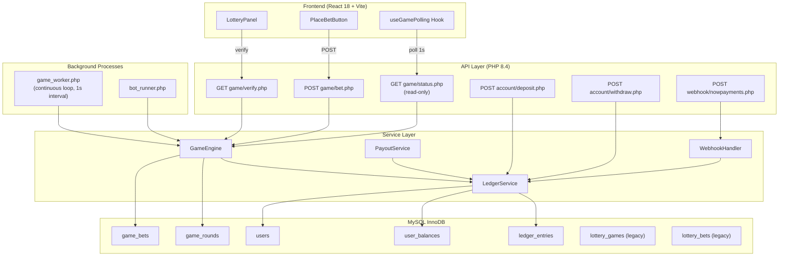
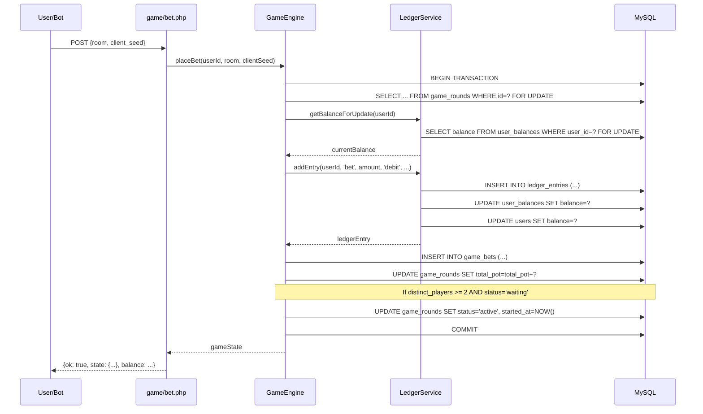
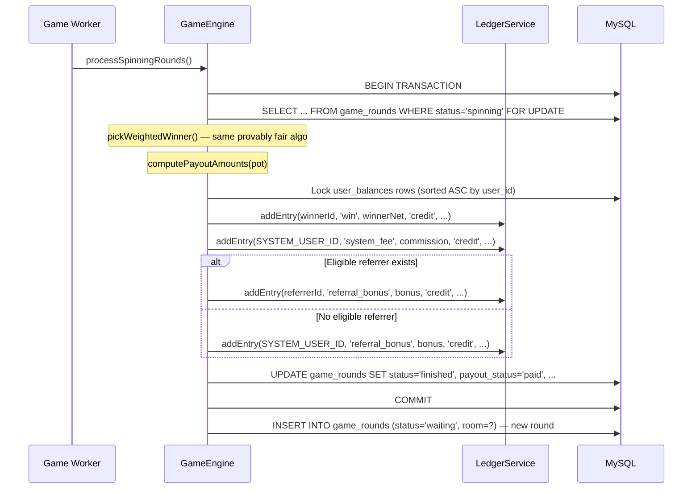
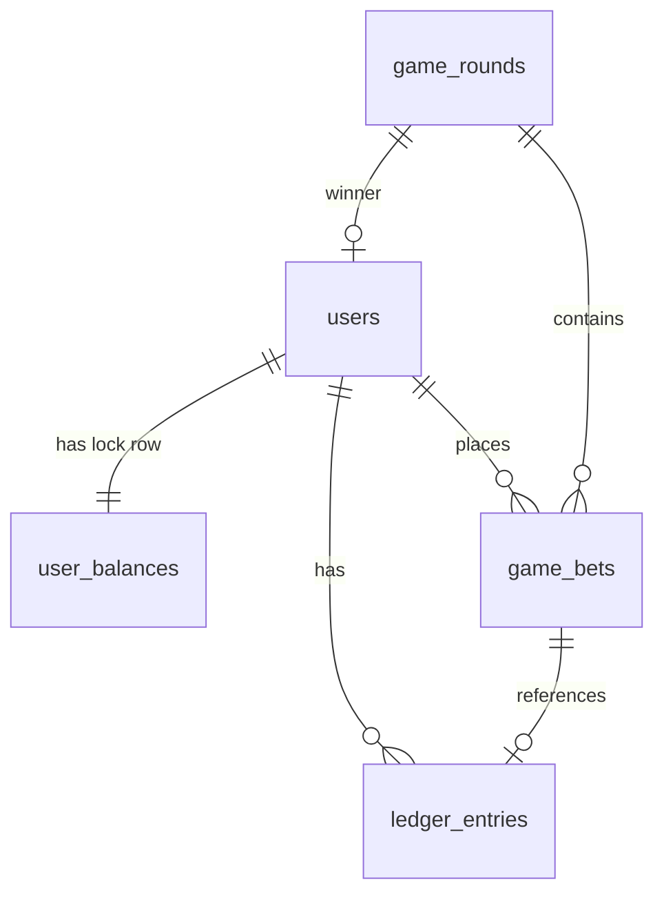

# Design Document: Ledger State Machine

## Overview

This design covers two tightly coupled architectural changes to the anora.bet lottery platform:

1. **Ledger-Based Accounting** — An append-only `ledger_entries` table replaces `users.balance` as the source of truth for all financial operations. A `user_balances` table provides scalable row-level locking. A `LedgerService` class centralizes all balance mutations with idempotency guarantees.

2. **Backend Game State Machine** — A `GameEngine` class and background `game_worker.php` process replace the frontend-driven `useGameMachine.js` hook. The backend controls all state transitions (`waiting` → `active` → `spinning` → `finished`) through a formal state machine. API endpoints become read-only (status polling) or write-only (bet placement). The frontend becomes a pure display layer.

Both features are interconnected: the GameEngine uses the LedgerService for all financial operations (bet deduction, winner payout, fee distribution), and the LedgerService replaces all direct `users.balance` mutations across deposits, withdrawals, crypto flows, and game payouts.

### Key Design Decisions

| Decision | Rationale |
|---|---|
| `user_balances` as lock target (not `ledger_entries`) | Avoids ORDER BY id DESC LIMIT 1 FOR UPDATE hotspot; single-row lock per user scales better |
| DECIMAL(20,8) precision | Supports crypto sub-cent operations while maintaining exact arithmetic |
| UNIQUE KEY `uniq_reference` for idempotency | Database-level duplicate rejection; no application-level check-then-insert race |
| Game Worker drives transitions (not API endpoints) | Decouples game lifecycle from HTTP request handling; prevents race conditions from concurrent API calls |
| Strict lock ordering: game_rounds → user_balances (ASC) → system account | Prevents deadlocks in multi-user payout transactions |
| System Account as ledger user (SYSTEM_USER_ID) | Unifies platform revenue tracking with user accounting; replaces `system_balance` singleton |
| `users.balance` retained as denormalized cache | Zero-cost reads for sidebar display, admin panel; updated atomically with each ledger entry |

---

## Architecture

### System Architecture Diagram



### Game State Machine Flow

```mermaid
stateDiagram-v2
    [*] --> waiting: Game Worker creates round

    waiting --> active: 2nd distinct player bets<br/>(GameEngine::placeBet)
    active --> spinning: Countdown expires (30s)<br/>(Game Worker)
    spinning --> finished: Winner selected + payout<br/>(Game Worker)
    finished --> [*]: Game Worker creates next round

    note right of waiting
        Bets accepted.
        No countdown yet.
    end note

    note right of active
        Bets accepted.
        30s countdown running.
        started_at = NOW()
    end note

    note right of spinning
        Bets CLOSED.
        Winner selection + payout in progress.
        spinning_at = NOW()
    end note

    note right of finished
        Results visible.
        server_seed revealed.
        finished_at = NOW()
    end note
```

### Transaction Flow: Bet Placement



### Transaction Flow: Payout Distribution



---

## Components and Interfaces

### LedgerService

```php
<?php

class LedgerService
{
    private PDO $pdo;

    public function __construct(PDO $pdo)
    {
        $this->pdo = $pdo;
    }

    /**
     * Insert a new ledger entry and update user_balances + users.balance cache.
     *
     * Idempotent: if a matching (reference_type, reference_id, user_id, type) exists,
     * returns the existing entry without inserting.
     *
     * Caller MUST have an open transaction. This method does NOT begin/commit.
     *
     * @param int         $userId
     * @param string      $type          One of: deposit, bet, win, system_fee, referral_bonus,
     *                                   withdrawal, withdrawal_refund, crypto_deposit,
     *                                   crypto_withdrawal, crypto_withdrawal_refund
     * @param float       $amount        Positive value
     * @param string      $direction     'credit' or 'debit'
     * @param string      $referenceId   Traceable reference (game_round_id, invoice_id, etc.)
     * @param string      $referenceType Traceable reference type (game_round, deposit, etc.)
     * @param array|null  $metadata      Optional: ip, user_agent, source, is_bot, etc.
     *
     * @return array The inserted (or existing) ledger entry row
     * @throws RuntimeException If direction='debit' and balance would go negative
     */
    public function addEntry(
        int     $userId,
        string  $type,
        float   $amount,
        string  $direction,
        string  $referenceId,
        string  $referenceType,
        ?array  $metadata = null
    ): array { /* ... */ }

    /**
     * Lock the user's balance row and return current balance.
     * Inserts a new user_balances row with 0.00 if none exists.
     *
     * Caller MUST have an open transaction.
     *
     * @return float Current locked balance
     */
    public function getBalanceForUpdate(int $userId): float { /* ... */ }

    /**
     * Auto-populate metadata fields from request context.
     * For HTTP requests: ip, user_agent from $_SERVER.
     * For workers: source = 'game_worker' or 'bot_runner'.
     */
    private function buildMetadata(?array $extra, string $source = 'api'): array { /* ... */ }
}
```

### GameEngine

```php
<?php

class GameEngine
{
    private PDO $pdo;
    private LedgerService $ledger;

    public function __construct(PDO $pdo, LedgerService $ledger)
    {
        $this->pdo    = $pdo;
        $this->ledger = $ledger;
    }

    /**
     * Place a bet in the specified room.
     * Validates room, balance, rate limit, game status.
     * Within a single transaction: deducts balance via ledger, inserts game_bet,
     * updates pot, and transitions waiting→active if ≥2 players.
     *
     * @throws RuntimeException On validation failure or insufficient balance
     */
    public function placeBet(int $userId, int $room, string $clientSeed = ''): array { /* ... */ }

    /**
     * Get current game state for a room (read-only, for polling endpoint).
     * Returns round info, bets, countdown, winner, user stats.
     */
    public function getGameState(int $room, ?int $currentUserId = null): array { /* ... */ }

    /**
     * Get or create the active game round for a room.
     */
    public function getOrCreateRound(int $room): array { /* ... */ }

    /**
     * Process waiting rounds: transition to active if ≥2 distinct players.
     * Called by game_worker.php.
     */
    public function processWaitingRounds(): void { /* ... */ }

    /**
     * Process active rounds: transition to spinning if countdown expired.
     * Called by game_worker.php.
     */
    public function processActiveRounds(): void { /* ... */ }

    /**
     * Process spinning rounds: select winner, distribute payouts, transition to finished.
     * Called by game_worker.php.
     * Implements strict lock ordering and 3-retry on deadlock.
     */
    public function processSpinningRounds(): void { /* ... */ }

    /**
     * Execute payout for a single spinning round.
     * Lock ordering: game_rounds → user_balances (ASC) → system account.
     * Double-payout protection via payout_status check + UNIQUE KEY.
     */
    private function executePayoutForRound(int $roundId): void { /* ... */ }

    /**
     * Get verification data for a finished game.
     * Supports both game_rounds (new) and lottery_games (legacy).
     */
    public function getVerifyData(int $gameId): array { /* ... */ }
}
```

### Game Worker (`backend/game_worker.php`)

```php
<?php
/**
 * Background process that drives all game state transitions.
 * Runs in a continuous loop with 1-second sleep between iterations.
 *
 * Execution model:
 *   - Launched via CLI: php game_worker.php
 *   - Managed by systemd/supervisor for auto-restart
 *   - Each iteration processes all 3 rooms (1, 10, 100)
 *   - Uses SELECT ... FOR UPDATE to prevent concurrent worker conflicts
 *
 * Transition responsibilities:
 *   - waiting → active:   when ≥2 distinct players (also handled by placeBet)
 *   - active → spinning:  when countdown (30s) expires
 *   - spinning → finished: winner selection + payout distribution
 *   - finished → new waiting: create next round
 */

require_once __DIR__ . '/config/db.php';
require_once __DIR__ . '/includes/lottery.php';

$ledger = new LedgerService($pdo);
$engine = new GameEngine($pdo, $ledger);

while (true) {
    try {
        $engine->processWaitingRounds();
        $engine->processActiveRounds();
        $engine->processSpinningRounds();
    } catch (Throwable $e) {
        error_log('[GameWorker] Error: ' . $e->getMessage());
    }
    sleep(1);
}
```

### API Endpoints

| Endpoint | Method | Auth | Description |
|---|---|---|---|
| `/backend/api/game/status.php` | GET | Optional | Read-only game state polling. Returns current round, bets, countdown, winner, balance. |
| `/backend/api/game/bet.php` | POST | Required | Place a bet. Delegates to `GameEngine::placeBet`. Returns updated state + balance. |
| `/backend/api/game/verify.php` | GET | None | Provably fair verification. Supports both new `game_rounds` and legacy `lottery_games`. |

### Lock Ordering Rule (HARD RULE)

All multi-user transactions MUST acquire locks in this exact order:

1. `game_rounds` row (`SELECT ... FOR UPDATE`)
2. `user_balances` rows sorted by `user_id` ASC (`SELECT ... FOR UPDATE`)
3. System Account `user_balances` row (SYSTEM_USER_ID — always last)

Violating this order WILL cause deadlocks under concurrent load.

---

## Data Models

### New Tables DDL

```sql
-- ═══════════════════════════════════════════════════════════════════════════════
-- 1. user_balances — row-level lock target for concurrency control
-- ═══════════════════════════════════════════════════════════════════════════════
CREATE TABLE IF NOT EXISTS user_balances (
    user_id  INT            NOT NULL PRIMARY KEY,
    balance  DECIMAL(20,8)  NOT NULL DEFAULT 0.00000000,
    FOREIGN KEY (user_id) REFERENCES users(id) ON DELETE CASCADE
) ENGINE=InnoDB;

-- ═══════════════════════════════════════════════════════════════════════════════
-- 2. ledger_entries — append-only immutable financial log
-- ═══════════════════════════════════════════════════════════════════════════════
CREATE TABLE IF NOT EXISTS ledger_entries (
    id              INT AUTO_INCREMENT PRIMARY KEY,
    user_id         INT            NOT NULL,
    type            VARCHAR(32)    NOT NULL,
    amount          DECIMAL(20,8)  NOT NULL,
    direction       ENUM('credit','debit') NOT NULL,
    balance_after   DECIMAL(20,8)  NOT NULL,
    reference_id    VARCHAR(64)    DEFAULT NULL,
    reference_type  VARCHAR(32)    DEFAULT NULL,
    metadata        JSON           DEFAULT NULL,
    created_at      DATETIME       NOT NULL DEFAULT CURRENT_TIMESTAMP,

    INDEX idx_user_id        (user_id),
    INDEX idx_user_created   (user_id, created_at),
    INDEX idx_reference      (reference_type, reference_id),
    INDEX idx_type           (type),
    UNIQUE KEY uniq_reference (reference_type, reference_id, user_id, type),

    FOREIGN KEY (user_id) REFERENCES users(id) ON DELETE CASCADE
) ENGINE=InnoDB;

-- ═══════════════════════════════════════════════════════════════════════════════
-- 3. game_rounds — backend state machine rounds
-- ═══════════════════════════════════════════════════════════════════════════════
CREATE TABLE IF NOT EXISTS game_rounds (
    id                   INT AUTO_INCREMENT PRIMARY KEY,
    room                 TINYINT        NOT NULL,
    status               ENUM('waiting','active','spinning','finished') NOT NULL DEFAULT 'waiting',
    server_seed          VARCHAR(64)    DEFAULT NULL,
    server_seed_hash     VARCHAR(64)    DEFAULT NULL,
    total_pot            DECIMAL(15,2)  NOT NULL DEFAULT 0.00,
    winner_id            INT            DEFAULT NULL,
    started_at           DATETIME       DEFAULT NULL,
    spinning_at          DATETIME       DEFAULT NULL,
    finished_at          DATETIME       DEFAULT NULL,
    payout_status        ENUM('pending','paid') NOT NULL DEFAULT 'pending',
    payout_id            VARCHAR(36)    DEFAULT NULL,
    commission           DECIMAL(12,2)  DEFAULT NULL,
    referral_bonus       DECIMAL(12,2)  DEFAULT NULL,
    winner_net           DECIMAL(12,2)  DEFAULT NULL,
    final_bets_snapshot  JSON           DEFAULT NULL,
    final_combined_hash  VARCHAR(64)    DEFAULT NULL,
    final_rand_unit      DECIMAL(20,12) DEFAULT NULL,
    final_target         DECIMAL(20,12) DEFAULT NULL,
    final_total_weight   DECIMAL(15,2)  DEFAULT NULL,
    created_at           DATETIME       NOT NULL DEFAULT CURRENT_TIMESTAMP,

    INDEX idx_room_status (room, status),
    INDEX idx_status      (status),
    UNIQUE KEY uniq_payout (payout_id),

    FOREIGN KEY (winner_id) REFERENCES users(id) ON DELETE SET NULL
) ENGINE=InnoDB;

-- ═══════════════════════════════════════════════════════════════════════════════
-- 4. game_bets — bets linked to game_rounds and ledger_entries
-- ═══════════════════════════════════════════════════════════════════════════════
CREATE TABLE IF NOT EXISTS game_bets (
    id               INT AUTO_INCREMENT PRIMARY KEY,
    round_id         INT            NOT NULL,
    user_id          INT            NOT NULL,
    amount           DECIMAL(10,2)  NOT NULL,
    client_seed      VARCHAR(64)    DEFAULT NULL,
    ledger_entry_id  INT            DEFAULT NULL,
    created_at       DATETIME       NOT NULL DEFAULT CURRENT_TIMESTAMP,

    INDEX idx_round_id    (round_id),
    INDEX idx_user_round  (user_id, round_id),

    FOREIGN KEY (round_id)        REFERENCES game_rounds(id)    ON DELETE CASCADE,
    FOREIGN KEY (user_id)         REFERENCES users(id)          ON DELETE CASCADE,
    FOREIGN KEY (ledger_entry_id) REFERENCES ledger_entries(id)  ON DELETE SET NULL
) ENGINE=InnoDB;
```

### System Account

The System Account uses `SYSTEM_USER_ID = 0`. A dedicated row is inserted into `users`:

```sql
INSERT IGNORE INTO users (id, email, password, balance, is_verified, is_bot, nickname)
VALUES (0, 'system@internal', '$2y$10$unusable_hash_system_cannot_login', 0.00, 1, 0, 'System');

INSERT IGNORE INTO user_balances (user_id, balance) VALUES (0, 0.00000000);
```

A PHP constant defines this:

```php
defined('SYSTEM_USER_ID') || define('SYSTEM_USER_ID', 0);
```

### Migration Script

The migration script (`backend/migrate_to_ledger.php`) performs:

1. Create `user_balances` rows for all users (including balance=0)
2. Create `user_balances` row for SYSTEM_USER_ID with current `system_balance.balance`
3. For each user with `balance > 0`: insert a `ledger_entries` row with `type='deposit'`, `reference_type='migration'`, `reference_id='initial_migration'`
4. For SYSTEM_USER_ID: insert a `ledger_entries` row with the system balance
5. Idempotent: skip users that already have a `reference_type='migration'` entry

### Entity Relationship




---

## Correctness Properties

*A property is a characteristic or behavior that should hold true across all valid executions of a system — essentially, a formal statement about what the system should do. Properties serve as the bridge between human-readable specifications and machine-verifiable correctness guarantees.*

### Property 1: Ledger Balance Chain Consistency

*For any* user and any sequence of ledger entries ordered by `id` ASC, each entry's `balance_after` SHALL equal the previous entry's `balance_after` plus `amount` (if credit) or minus `amount` (if debit). The first entry's `balance_after` SHALL equal its `amount` (if credit) or negative `amount` would be rejected.

**Validates: Requirements 2.3, 23.2, 25.1**

### Property 2: Three-Way Balance Consistency

*For any* user with at least one ledger entry, the following three values SHALL be equal: (a) `users.balance`, (b) `user_balances.balance`, (c) the `balance_after` of the user's most recent `ledger_entries` row (by `id` DESC).

**Validates: Requirements 2.7, 23.3, 23.5, 28.4, 28.6**

### Property 3: Ledger Balance Equals Sum of Operations

*For any* user, the `balance_after` of their most recent ledger entry SHALL equal the sum of all their credit entry amounts minus the sum of all their debit entry amounts.

**Validates: Requirements 23.1, 25.2**

### Property 4: Non-Negative Balance Invariant

*For any* ledger entry, `balance_after` SHALL be greater than or equal to `0.00`. Equivalently, *for any* debit attempt where `amount > current_balance`, the LedgerService SHALL reject the operation and no entry SHALL be inserted.

**Validates: Requirements 2.4, 23.4**

### Property 5: Idempotent Ledger Entry Insertion

*For any* ledger entry parameters `(reference_type, reference_id, user_id, type)`, calling `addEntry` twice with the same parameters SHALL return the same entry and the user's balance SHALL change only once (the second call is a no-op).

**Validates: Requirements 1.3, 2.2**

### Property 6: Financial Operation Produces Ledger Entry

*For any* financial operation (deposit, withdrawal, bet, win, system_fee, referral_bonus, crypto_deposit, crypto_withdrawal, crypto_withdrawal_refund), a corresponding `ledger_entries` row SHALL exist with the correct `type`, `direction`, `amount`, `reference_id`, and `reference_type`.

**Validates: Requirements 5.1, 5.2, 6.1, 6.2, 6.3, 6.4, 7.1, 7.2, 7.3, 7.4, 19.1, 19.2, 19.3**

### Property 7: Payout Conservation

*For any* finished game round with `total_pot >= 0.50`, the sum `winner_net + commission + referral_bonus` SHALL equal `total_pot`. The `winner_net` SHALL be approximately 97% of pot, `commission` approximately 2%, and `referral_bonus` approximately 1%, subject to the existing `computePayoutAmounts` rounding rules and micro-pot exception.

**Validates: Requirements 7.5, 12.2**

### Property 8: Bet-Pot Conservation

*For any* finished game round, the sum of all `bet`-type debit ledger entries referencing that round SHALL equal the `game_rounds.total_pot` value.

**Validates: Requirements 25.3**

### Property 9: State Machine Transition Validity

*For any* game round, the status transitions SHALL follow the sequence `waiting` → `active` → `spinning` → `finished` only. *For any* attempted transition that violates this sequence (e.g., `waiting` → `spinning`, `active` → `finished`, `finished` → `active`), the GameEngine SHALL reject the transition.

**Validates: Requirements 10.1, 10.6**

### Property 10: Waiting-to-Active Transition Trigger

*For any* game round in `waiting` status, the round SHALL transition to `active` if and only if the number of distinct players (by `user_id`) with bets in that round is ≥ 2.

**Validates: Requirements 10.2, 11.6**

### Property 11: Bet Rejection When Game Closed

*For any* game round in `spinning` or `finished` status, *for any* bet placement attempt, the GameEngine SHALL reject the bet with an error and no ledger entry, game_bet, or pot update SHALL be created.

**Validates: Requirements 11.4**

### Property 12: Insufficient Balance Rejection

*For any* user with balance `B` and *for any* bet amount `A > B`, the GameEngine SHALL reject the bet, and the user's balance, ledger entries, and game_bets SHALL remain unchanged.

**Validates: Requirements 2.4, 11.3**

### Property 13: Double-Payout Protection (Idempotence)

*For any* game round with `payout_status = 'paid'`, calling the payout execution again SHALL be a no-op: no additional ledger entries SHALL be created, no balances SHALL change, and the function SHALL return immediately.

**Validates: Requirements 12.6, 12.7, 12.8, 8.4**

### Property 14: Provably Fair Determinism

*For any* set of inputs `(server_seed, client_seeds[], game_id)`, the functions `buildCombinedHashFromSeeds`, `hashToFloat`, `computeTarget`, and `lowerBound` SHALL produce identical outputs to the existing implementation. Specifically, `hashToFloat(buildCombinedHashFromSeeds(server_seed, client_seeds, game_id))` SHALL return the same float value regardless of whether called from the old `lottery.php` or the new `GameEngine`.

**Validates: Requirements 12.1, 16.3**

### Property 15: Bet Placement Atomicity

*For any* successful bet placement, ALL of the following artifacts SHALL exist: (a) a `ledger_entries` row with `type='bet'`, (b) a `game_bets` row with `ledger_entry_id` pointing to that ledger entry, (c) `game_rounds.total_pot` incremented by the bet amount. *For any* failed bet placement, NONE of these artifacts SHALL exist.

**Validates: Requirements 11.2, 22.1**

### Property 16: Payout Atomicity

*For any* finished game round with `payout_status = 'paid'`, ALL of the following SHALL exist: (a) a `win`-type credit ledger entry for the winner, (b) a `system_fee`-type credit ledger entry on SYSTEM_USER_ID, (c) either a `referral_bonus`-type credit entry on the referrer OR on SYSTEM_USER_ID, (d) `game_rounds.payout_status = 'paid'` with a non-null `payout_id`.

**Validates: Requirements 12.2, 22.2**

### Property 17: Status Endpoint Read-Only

*For any* call to `GET game/status.php`, the `game_rounds` table SHALL have no status changes as a result of the call. The endpoint SHALL return data without triggering any state transitions.

**Validates: Requirements 13.5, 14.3**

### Property 18: Status Response Contains Required Fields

*For any* call to `GET game/status.php` with a valid room parameter, the response SHALL contain: `round_id`, `status`, `total_pot`, `server_seed_hash`, `room`, `bets`, `unique_players`, `total_bets`. When status is `active`, `countdown` SHALL be present and equal to `max(0, 30 - elapsed_seconds)`. When status is `finished`, `winner` and `server_seed` SHALL be present.

**Validates: Requirements 14.1, 14.2**

### Property 19: Migration Idempotence

*For any* set of users, running the migration script twice SHALL produce the same result as running it once: the same number of `ledger_entries` rows, the same `user_balances` rows, and the same balance values.

**Validates: Requirements 4.1, 4.3, 4.5**

### Property 20: Bot Withdrawal Hard Block

*For any* user with `is_bot = 1`, *for any* withdrawal request (fiat or crypto), the System SHALL reject the request. No debit ledger entry SHALL be created.

**Validates: Requirements 17.8**

### Property 21: Bot Balance Cap

*For any* bot user with balance exceeding the configured cap (default $50,000), the bot_runner SHALL NOT execute a top-up operation. The bot's balance SHALL not increase from top-up when already above the cap.

**Validates: Requirements 17.6**

### Property 22: Rate Limit Enforcement

*For any* user, if they have placed ≥ 5 bets within the last 1 second (per-second limit) or ≥ 60 bets within the last 1 minute (per-minute limit), the next bet placement SHALL be rejected with a rate limit error.

**Validates: Requirements 11.5, 27.1**

### Property 23: Referrer Eligibility Preservation

*For any* game payout where the winner has a referrer, the referral bonus SHALL be paid to the referrer only if ALL of the following hold: `is_verified = 1`, `is_banned = 0`, account age ≥ 24 hours, and at least one completed deposit. If any condition fails, the bonus SHALL be routed to the System Account.

**Validates: Requirements 18.2, 18.3**

### Property 24: Metadata Population

*For any* ledger entry created from an HTTP request context, the `metadata` JSON SHALL contain `ip` and `user_agent` fields. *For any* ledger entry created by a background worker, the `metadata` SHALL contain `source` set to `game_worker` or `bot_runner`. *For any* bot-related ledger entry, `metadata` SHALL contain `is_bot = true`.

**Validates: Requirements 1.8, 2.8, 17.7, 27.3**

### Property 25: Verification Data Completeness

*For any* finished game (in either `game_rounds` or legacy `lottery_games`), the verify endpoint SHALL return: `server_seed`, `server_seed_hash`, `combined_hash`, `rand_unit`, `target`, `total_weight`, `cumulative_weights`, `winner_index`, and `winner_id`. For games with a `final_bets_snapshot`, the snapshot SHALL be used; for legacy games, live bet data SHALL be queried.

**Validates: Requirements 16.1, 16.2, 24.2**

### Property 26: Reference Required for All Entries

*For any* call to `LedgerService::addEntry`, `reference_id` and `reference_type` SHALL be non-null. Any attempt to insert a ledger entry without these fields SHALL be rejected.

**Validates: Requirements 2.9**

---

## Error Handling

| Error Condition | Component | Response | Recovery |
|---|---|---|---|
| Insufficient balance on debit | LedgerService | Throw `RuntimeException("Insufficient balance")` | Caller catches, returns HTTP 400 |
| Duplicate ledger entry (idempotency) | LedgerService | Return existing entry silently | No action needed — idempotent |
| Null reference_id or reference_type | LedgerService | Throw `InvalidArgumentException` | Caller must provide valid references |
| MySQL deadlock (error 1213) | GameEngine payout | Retry up to 3 times with 50ms/100ms/150ms backoff | After 3 failures, log FATAL and propagate |
| MySQL lock wait timeout (error 1205) | GameEngine payout | Same retry as deadlock | Same as deadlock |
| Bet on closed game (spinning/finished) | GameEngine | Throw `RuntimeException("Betting is closed")` | Caller returns HTTP 400 |
| Invalid room value | GameEngine | Throw `InvalidArgumentException("Invalid room")` | Caller returns HTTP 400 |
| Rate limit exceeded (5/sec or 60/min) | GameEngine | Throw `RuntimeException("Rate limit exceeded")` | Caller returns HTTP 400 |
| Invalid client_seed format | GameEngine | Throw `RuntimeException("Invalid client seed format")` | Caller returns HTTP 400 |
| Bot withdrawal attempt | PayoutService / Withdraw endpoint | Throw `RuntimeException("Withdrawals disabled for bot accounts")` | Caller returns HTTP 403 |
| No bets in spinning round | GameEngine | Mark game finished with no winner, create next round | Log warning, continue |
| Payout already paid (double-payout) | GameEngine | Return immediately (no-op) | Log info, no action |
| UNIQUE KEY violation on payout_id | GameEngine | Catch PDOException 23000, treat as already paid | Log, return existing game |
| Transaction rollback on any failure | All services | `$pdo->rollBack()` if `inTransaction()` | Propagate exception to caller |
| Game Worker crash | game_worker.php | Log error, continue loop | systemd/supervisor auto-restarts |
| Migration duplicate entry | migrate_to_ledger.php | Skip user (idempotent) | Log skip, continue |
| Webhook invalid HMAC signature | WebhookHandler | Throw `RuntimeException("Invalid webhook signature")` | Return HTTP 401 |
| Crypto API failure during withdrawal | PayoutService | Immediate refund via LedgerService | Log error, credit balance back |

---

## Testing Strategy

### Dual Testing Approach

This feature requires both unit tests and property-based tests for comprehensive coverage:

- **Unit tests**: Verify specific examples, edge cases, integration points, and error conditions
- **Property-based tests**: Verify universal properties across randomly generated inputs (minimum 100 iterations per property)

Both are complementary: unit tests catch concrete bugs at specific values, property tests verify general correctness across the input space.

### Property-Based Testing Library

- **Library**: [PHPUnit + `eris/eris`](https://github.com/giorgiosironi/eris) (PHP property-based testing library)
- **Alternative**: If eris is unavailable, use `innmind/black-box` or implement generators with PHPUnit data providers
- **Configuration**: Each property test runs minimum 100 iterations
- **Tagging**: Each test MUST include a comment referencing the design property:
  ```php
  // Feature: ledger-state-machine, Property 1: Ledger Balance Chain Consistency
  ```

### Unit Test Focus Areas

- LedgerService::addEntry with specific deposit/withdrawal/bet amounts
- GameEngine::placeBet with edge cases (exact balance, zero balance, negative amount)
- State machine transitions at boundary conditions (exactly 2 players, exactly 30s countdown)
- Migration script with empty database, single user, multiple users
- Provably fair functions with known test vectors from existing tests
- Bot withdrawal rejection
- Rate limit at exactly the threshold (5th bet in 1 second)
- Payout with micro-pot (< $0.50) exception
- Referrer eligibility edge cases (banned, unverified, no deposit, too new)

### Property Test Mapping

Each correctness property maps to exactly one property-based test:

| Property | Test File | Generator Strategy |
|---|---|---|
| P1: Balance Chain Consistency | `LedgerChainPropertyTest.php` | Generate random sequences of credits/debits with random amounts |
| P2: Three-Way Balance Consistency | `BalanceConsistencyPropertyTest.php` | Generate random financial operations, verify all three balance sources match |
| P3: Balance Equals Sum | `BalanceSumPropertyTest.php` | Generate random operation sequences, verify sum equals balance_after |
| P4: Non-Negative Balance | `NonNegativeBalancePropertyTest.php` | Generate random debit amounts including amounts > balance |
| P5: Idempotent Entry | `IdempotencyPropertyTest.php` | Generate random entries, insert twice, verify single effect |
| P6: Operation Produces Entry | `LedgerEntryExistencePropertyTest.php` | Generate random financial operations, verify ledger entry exists |
| P7: Payout Conservation | `PayoutConservationPropertyTest.php` | Generate random pot amounts, verify winner_net + commission + referral = pot |
| P8: Bet-Pot Conservation | `BetPotPropertyTest.php` | Generate random bet sequences, verify sum of bets = total_pot |
| P9: State Transition Validity | `StateTransitionPropertyTest.php` | Generate random transition attempts, verify only valid ones succeed |
| P10: Waiting-to-Active Trigger | `WaitingActivePropertyTest.php` | Generate random player counts, verify transition at exactly ≥2 |
| P11: Bet Rejection Closed | `BetRejectionPropertyTest.php` | Generate bets against spinning/finished games, verify all rejected |
| P12: Insufficient Balance | `InsufficientBalancePropertyTest.php` | Generate random balances and bet amounts where amount > balance |
| P13: Double-Payout Protection | `DoublePayoutPropertyTest.php` | Generate paid games, call payout again, verify no-op |
| P14: Provably Fair Determinism | `ProvablyFairPropertyTest.php` | Generate random seeds and game IDs, verify identical outputs |
| P15: Bet Atomicity | `BetAtomicityPropertyTest.php` | Generate random bets (success and failure), verify all-or-nothing |
| P16: Payout Atomicity | `PayoutAtomicityPropertyTest.php` | Generate random payouts, verify all artifacts exist together |
| P17: Status Read-Only | `StatusReadOnlyPropertyTest.php` | Generate random game states, call status, verify no mutations |
| P18: Status Response Fields | `StatusResponsePropertyTest.php` | Generate random game states, verify all required fields present |
| P19: Migration Idempotence | `MigrationIdempotencePropertyTest.php` | Generate random user sets, run migration twice, verify same result |
| P20: Bot Withdrawal Block | `BotWithdrawalPropertyTest.php` | Generate random bot users and withdrawal amounts, verify all rejected |
| P21: Bot Balance Cap | `BotBalanceCapPropertyTest.php` | Generate random bot balances above cap, verify no top-up |
| P22: Rate Limit | `RateLimitPropertyTest.php` | Generate random bet sequences exceeding rate limits, verify rejection |
| P23: Referrer Eligibility | `ReferrerEligibilityPropertyTest.php` | Generate random referrer states, verify correct routing |
| P24: Metadata Population | `MetadataPropertyTest.php` | Generate random request contexts, verify metadata fields present |
| P25: Verification Completeness | `VerificationPropertyTest.php` | Generate random finished games, verify all fields present |
| P26: Reference Required | `ReferenceRequiredPropertyTest.php` | Generate entries with null references, verify rejection |
