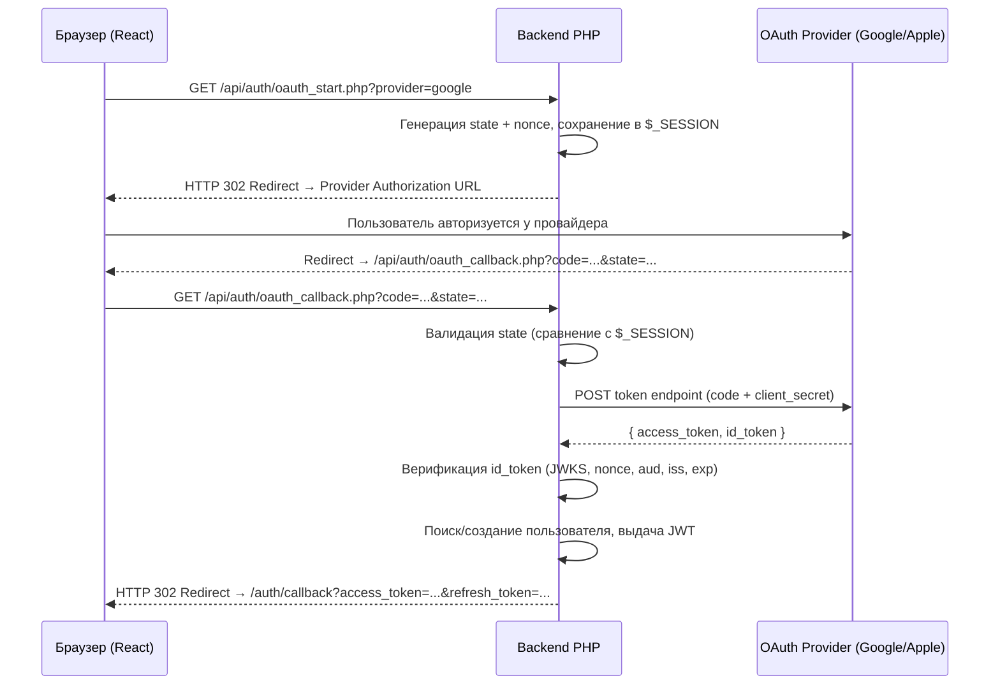
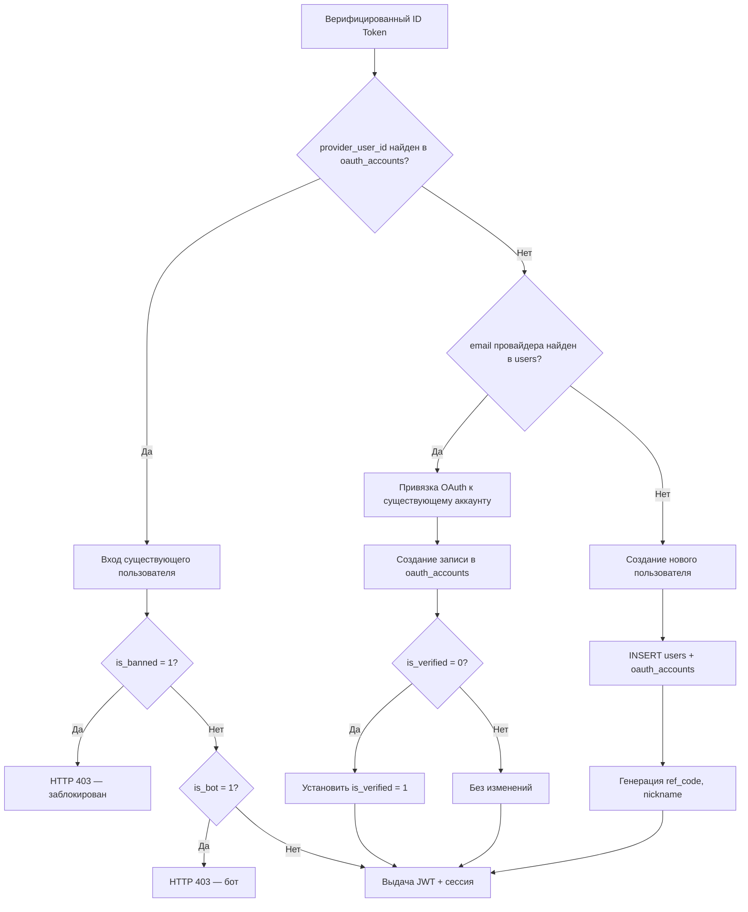
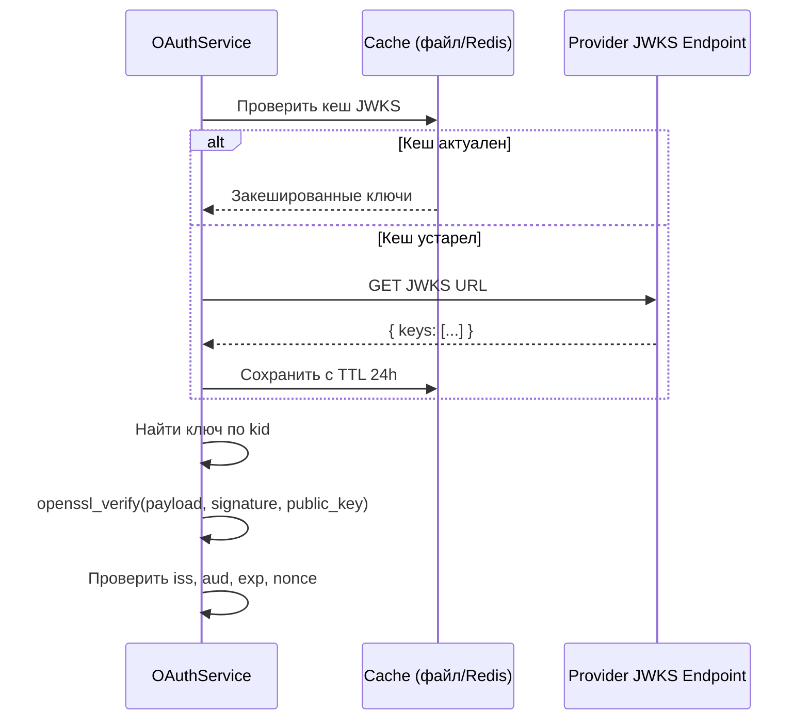

# Дизайн-документ: OAuth Social Login

## Обзор

Данный документ описывает техническую архитектуру интеграции OAuth 2.0 / OpenID Connect для входа через Google и Apple на платформу ANORA. Решение расширяет существующую систему аутентификации (email/password + PHP sessions + JWT) новыми OAuth-потоками, сохраняя полную обратную совместимость.

Ключевые принципы:
- Server-side Authorization Code Flow — обмен кода на токены происходит только на бэкенде
- ID Token верификация через JWKS (публичные ключи провайдеров)
- CSRF-защита через `state` параметр, replay-защита через `nonce`
- Автоматическая привязка OAuth к существующим аккаунтам по совпадению email
- Поддержка Apple Private Relay Email
- OAuth-only пользователи (без пароля)

## Архитектура

### Общая схема OAuth-потока



### Схема принятия решений при callback



## Компоненты и интерфейсы

### Новые файлы бэкенда

| Файл | Назначение |
|------|-----------|
| `backend/includes/oauth_service.php` | Основной сервис: генерация URL, обмен кода, верификация ID Token, JWKS-кеширование |
| `backend/api/auth/oauth_start.php` | Эндпоинт инициации OAuth-потока (генерация state/nonce, редирект) |
| `backend/api/auth/oauth_callback.php` | Эндпоинт обработки callback (валидация, поиск/создание пользователя, выдача токенов) |
| `backend/config/oauth.php` | Конфигурация OAuth-провайдеров из env vars |
| `backend/migrations/add_oauth_accounts.php` | Миграция: создание таблицы `oauth_accounts`, изменение `users.password` |

### Новые файлы фронтенда

| Файл | Назначение |
|------|-----------|
| `frontend/src/pages/OAuthCallback.jsx` | Страница обработки редиректа после OAuth (парсинг токенов, обновление AuthContext) |
| `frontend/src/components/ui/OAuthButtons.jsx` | Компонент кнопок "Sign in with Google" / "Sign in with Apple" |

### Изменяемые файлы

| Файл | Изменения |
|------|-----------|
| `frontend/src/pages/Login.jsx` | Добавление `<OAuthButtons />` под формой |
| `frontend/src/pages/Register.jsx` | Добавление `<OAuthButtons />` под формой |
| `frontend/src/App.jsx` | Добавление маршрута `/auth/callback` |
| `frontend/src/context/AuthContext.jsx` | Добавление метода `loginWithTokens(accessToken, refreshToken)` |
| `frontend/src/api/client.js` | Добавление `oauthStart` метода |
| `frontend/src/services/authService.js` | Добавление `oauthStart(provider)` |
| `backend/api/auth/login.php` | Проверка пустого пароля для OAuth-only пользователей |
| `.env.example` | Добавление OAuth env vars |
| `database.sql` | Добавление таблицы `oauth_accounts` |

### API-эндпоинты

#### `GET /api/auth/oauth_start.php?provider={google|apple}`

Инициирует OAuth-поток.

- Генерирует `state` (32 байта, `bin2hex(random_bytes(32))`)
- Генерирует `nonce` (32 байта, `bin2hex(random_bytes(32))`)
- Сохраняет `state`, `nonce`, `provider` в `$_SESSION`
- Возвращает HTTP 302 на Authorization URL провайдера

#### `GET /api/auth/oauth_callback.php?code={code}&state={state}`

Для Apple также принимает POST (form_post): `POST /api/auth/oauth_callback.php` с телом `code`, `state`, `id_token`.

- Валидирует `state` против `$_SESSION['oauth_state']`
- Обменивает `code` на токены через server-to-server запрос
- Верифицирует `id_token` (подпись JWKS, nonce, aud, iss, exp)
- Выполняет логику поиска/создания пользователя
- Редиректит на `{FRONTEND_URL}/auth/callback?access_token=...&refresh_token=...`
- При ошибке: редиректит на `{FRONTEND_URL}/auth/callback?error=...`

### Интерфейс OAuthService (PHP)

```php
class OAuthService
{
    // Конфигурация
    public function __construct(array $config);
    
    // Генерация Authorization URL
    public function getAuthorizationUrl(string $provider, string $state, string $nonce): string;
    
    // Обмен authorization code на токены
    public function exchangeCode(string $provider, string $code): array; // {access_token, id_token}
    
    // Верификация ID Token (JWKS, claims)
    public function verifyIdToken(string $provider, string $idToken, string $expectedNonce): array; // {sub, email, name}
    
    // Получение JWKS (с кешированием в файл/Redis)
    public function fetchJwks(string $provider): array;
    
    // Генерация Apple client_secret (JWT, подписанный приватным ключом)
    public function generateAppleClientSecret(): string;
    
    // Поиск или создание пользователя по OAuth-данным
    public function findOrCreateUser(PDO $pdo, string $provider, array $claims): array; // {user, is_new}
}
```


### Конфигурация OAuth-провайдеров (`backend/config/oauth.php`)

```php
<?php
return [
    'google' => [
        'client_id'     => getenv('GOOGLE_CLIENT_ID'),
        'client_secret' => getenv('GOOGLE_CLIENT_SECRET'),
        'auth_url'      => 'https://accounts.google.com/o/oauth2/v2/auth',
        'token_url'     => 'https://oauth2.googleapis.com/token',
        'jwks_url'      => 'https://www.googleapis.com/oauth2/v3/certs',
        'issuer'        => 'https://accounts.google.com',
        'scope'         => 'openid email profile',
    ],
    'apple' => [
        'client_id'        => getenv('APPLE_CLIENT_ID'),
        'team_id'          => getenv('APPLE_TEAM_ID'),
        'key_id'           => getenv('APPLE_KEY_ID'),
        'private_key_path' => getenv('APPLE_PRIVATE_KEY_PATH'),
        'auth_url'         => 'https://appleid.apple.com/auth/authorize',
        'token_url'        => 'https://appleid.apple.com/auth/token',
        'jwks_url'         => 'https://appleid.apple.com/auth/keys',
        'issuer'           => 'https://appleid.apple.com',
        'scope'            => 'name email',
    ],
    'redirect_uri' => getenv('OAUTH_REDIRECT_URI'),
];
```

### Верификация ID Token (JWKS)

Процесс верификации ID Token:

1. Получить JWKS (JSON Web Key Set) от провайдера (кешировать на 24 часа)
2. Извлечь `kid` (Key ID) из заголовка JWT
3. Найти соответствующий публичный ключ в JWKS
4. Верифицировать подпись JWT (RS256) с помощью `openssl_verify()`
5. Проверить claims: `iss`, `aud`, `exp`, `nonce`
6. Извлечь `sub` (Provider_User_ID), `email`, `name`



### Генерация Apple Client Secret

Apple требует JWT в качестве `client_secret`, подписанный приватным ключом разработчика:

```
Header: { "alg": "ES256", "kid": APPLE_KEY_ID }
Payload: {
    "iss": APPLE_TEAM_ID,
    "iat": time(),
    "exp": time() + 15777000, // ~6 месяцев
    "aud": "https://appleid.apple.com",
    "sub": APPLE_CLIENT_ID
}
Signature: ES256 с приватным ключом
```

## Модели данных

### Таблица `oauth_accounts`

```sql
CREATE TABLE IF NOT EXISTS oauth_accounts (
    id               INT AUTO_INCREMENT PRIMARY KEY,
    user_id          INT NOT NULL,
    provider         ENUM('google', 'apple') NOT NULL,
    provider_user_id VARCHAR(255) NOT NULL,
    provider_email   VARCHAR(255) DEFAULT NULL,
    created_at       DATETIME NOT NULL DEFAULT CURRENT_TIMESTAMP,
    
    UNIQUE KEY uniq_provider_user (provider, provider_user_id),
    INDEX idx_user_id (user_id),
    INDEX idx_provider_email (provider, provider_email),
    
    CONSTRAINT fk_oauth_user FOREIGN KEY (user_id) 
        REFERENCES users(id) ON DELETE CASCADE
) ENGINE=InnoDB DEFAULT CHARSET=utf8mb4 COLLATE=utf8mb4_unicode_ci;
```

### Изменение таблицы `users`

```sql
-- Сделать password nullable для OAuth-only пользователей
ALTER TABLE users MODIFY COLUMN password VARCHAR(255) NOT NULL DEFAULT '';
```

OAuth-only пользователи будут иметь `password = ''` (пустая строка). Функция `password_verify()` в PHP корректно вернёт `false` для пустого хеша, предотвращая вход по пустому паролю.

### Новые переменные окружения

```env
# ── OAuth ────────────────────────────────────────────────────────────────────
GOOGLE_CLIENT_ID=
GOOGLE_CLIENT_SECRET=
APPLE_CLIENT_ID=
APPLE_TEAM_ID=
APPLE_KEY_ID=
APPLE_PRIVATE_KEY_PATH=
OAUTH_REDIRECT_URI=https://anora.bet/backend/api/auth/oauth_callback.php
FRONTEND_URL=https://anora.bet
```

### Структура данных в сессии (OAuth flow)

```php
$_SESSION['oauth_state']    = string; // 64 hex chars (32 bytes)
$_SESSION['oauth_nonce']    = string; // 64 hex chars (32 bytes)
$_SESSION['oauth_provider'] = string; // 'google' | 'apple'
```

### Формат ответа при успешной OAuth-аутентификации

Бэкенд не возвращает JSON напрямую — он редиректит на фронтенд:

```
HTTP 302 Location: {FRONTEND_URL}/auth/callback?access_token={jwt}&refresh_token={token}&is_new={0|1}
```

При ошибке:
```
HTTP 302 Location: {FRONTEND_URL}/auth/callback?error={error_code}&message={url_encoded_message}
```


## Свойства корректности (Correctness Properties)

*Свойство (property) — это характеристика или поведение, которое должно выполняться при всех допустимых выполнениях системы. По сути, это формальное утверждение о том, что система должна делать. Свойства служат мостом между человекочитаемыми спецификациями и машинно-верифицируемыми гарантиями корректности.*

### Property 1: Уникальность связки провайдер + provider_user_id

*Для любого* провайдера и provider_user_id, попытка создать вторую запись в `oauth_accounts` с той же парой (provider, provider_user_id) должна быть отклонена базой данных (нарушение уникального индекса).

**Validates: Requirements 1.2**

### Property 2: Каскадное удаление OAuth-аккаунтов

*Для любого* пользователя с привязанными OAuth-аккаунтами, удаление пользователя из таблицы `users` должно привести к удалению всех связанных записей из `oauth_accounts`.

**Validates: Requirements 1.3**

### Property 3: Длина и уникальность security-токенов (state, nonce)

*Для любого* сгенерированного state или nonce параметра, его длина в байтах должна быть не менее 32, и любые два независимо сгенерированных значения должны быть различны.

**Validates: Requirements 2.1, 2.2**

### Property 4: Authorization URL содержит все обязательные параметры

*Для любого* провайдера (Google или Apple), сгенерированный Authorization URL должен содержать все обязательные параметры: `response_type`, `client_id`, `redirect_uri`, `scope`, `state`, `nonce` (и `response_mode=form_post` для Apple).

**Validates: Requirements 2.4, 2.5**

### Property 5: Валидация state параметра при callback

*Для любого* OAuth callback запроса, если параметр `state` не совпадает со значением, сохранённым в сессии, запрос должен быть отклонён (HTTP 403).

**Validates: Requirements 3.1, 3.2**

### Property 6: Верификация ID Token — отклонение невалидных claims

*Для любого* ID Token и любого провайдера, если хотя бы один из claims (`nonce`, `aud`, `iss`, `exp`) не соответствует ожидаемому значению, верификация должна завершиться неудачей.

**Validates: Requirements 3.7, 3.8, 3.9, 3.10, 3.11**

### Property 7: Верификация подписи ID Token через JWKS

*Для любого* ID Token, подписанного известным ключом из JWKS провайдера, верификация подписи должна пройти успешно. *Для любого* ID Token с изменённой подписью или payload, верификация должна завершиться неудачей.

**Validates: Requirements 3.5, 3.6**

### Property 8: Создание нового пользователя через OAuth

*Для любых* валидных OAuth claims, где ни provider_user_id не найден в `oauth_accounts`, ни email не найден в `users`, система должна создать нового пользователя с `is_verified = 1`, непустым `nickname`, непустым `ref_code`, заполненным `registration_ip`, и соответствующую запись в `oauth_accounts`.

**Validates: Requirements 4.1, 4.2, 4.3, 4.4**

### Property 9: Вход существующего OAuth-пользователя

*Для любого* существующего пользователя с привязанным OAuth-аккаунтом (не забаненного, не бота), аутентификация через OAuth должна вернуть валидные JWT access_token и refresh_token, и установить `$_SESSION['user_id']`.

**Validates: Requirements 5.1, 5.2, 5.3, 4.5**

### Property 10: Отклонение входа для забаненных и бот-аккаунтов

*Для любого* OAuth-аккаунта, связанного с пользователем, у которого `is_banned = 1` или `is_bot = 1`, попытка OAuth-аутентификации должна быть отклонена с HTTP 403.

**Validates: Requirements 5.4, 5.5**

### Property 11: Автоматическая привязка OAuth по email

*Для любого* OAuth callback, где provider_user_id не найден в `oauth_accounts`, но email провайдера совпадает с email существующего пользователя, система должна создать запись в `oauth_accounts`, привязав OAuth к существующему пользователю, сохранив его пароль без изменений.

**Validates: Requirements 6.1, 6.2, 6.3**

### Property 12: Верификация пользователя при OAuth-привязке

*Для любого* существующего пользователя с `is_verified = 0`, при привязке OAuth-аккаунта с подтверждённым email, поле `is_verified` должно быть установлено в `1`.

**Validates: Requirements 6.4**

### Property 13: Идентификация Apple-пользователей по provider_user_id

*Для любого* Apple-пользователя, поиск должен выполняться по `provider_user_id` (claim `sub`), а не по email. Если email изменился (например, Private Relay), но `sub` остался прежним, должен быть найден тот же пользователь.

**Validates: Requirements 7.3**

### Property 14: Отклонение email/password входа для OAuth-only пользователей

*Для любого* пользователя с пустым паролем (OAuth-only), попытка входа через email/password форму с любым паролем (включая пустую строку) должна быть отклонена с сообщением "Используйте вход через Google или Apple".

**Validates: Requirements 10.1, 10.2, 10.3**

### Property 15: Ошибка при отсутствии обязательных env vars

*Для любой* отсутствующей обязательной переменной окружения OAuth-провайдера, система должна вернуть HTTP 500 и записать ошибку в лог.

**Validates: Requirements 8.8**

### Property 16: Удаление state/nonce из сессии после использования

*Для любого* успешного OAuth callback, после обработки запроса сессия не должна содержать `oauth_state` и `oauth_nonce`, предотвращая повторное использование.

**Validates: Requirements 9.3**

### Property 17: Rate limiting OAuth callback

*Для любого* IP-адреса, после 10 OAuth callback запросов в течение одной минуты, последующие запросы должны быть отклонены с HTTP 429.

**Validates: Requirements 9.4**

### Property 18: Идемпотентность миграции

*Для любого* количества запусков миграции `add_oauth_accounts.php`, повторный запуск не должен вызывать ошибок и не должен изменять существующие данные.

**Validates: Requirements 13.2**

### Property 19: HTTPS для всех URL провайдеров

*Для любого* URL, генерируемого OAuthService для взаимодействия с провайдерами (authorization URL, token URL, JWKS URL), схема должна быть `https://`.

**Validates: Requirements 9.2**

### Property 20: Логирование OAuth-попыток

*Для любой* попытки OAuth-аутентификации (успешной или неуспешной), система должна создать запись в логе через StructuredLogger с указанием провайдера, IP-адреса и User-Agent.

**Validates: Requirements 9.5**


## Обработка ошибок

### Ошибки OAuth-потока

| Ситуация | HTTP код | Действие |
|----------|----------|----------|
| Отсутствует env var провайдера | 500 | Лог ошибки, JSON `{"error": "OAuth provider not configured"}` |
| Неизвестный провайдер | 400 | JSON `{"error": "Unsupported provider"}` |
| State mismatch / отсутствует | 403 | Редирект на `/auth/callback?error=state_mismatch` |
| Сессия с state истекла | 403 | Редирект на `/auth/callback?error=session_expired` |
| Ошибка обмена code на токены | 502 | Редирект на `/auth/callback?error=token_exchange_failed` |
| Невалидная подпись ID Token | 403 | Редирект на `/auth/callback?error=invalid_token` |
| Невалидные claims (nonce/aud/iss/exp) | 403 | Редирект на `/auth/callback?error=invalid_claims` |
| Пользователь забанен | 403 | Редирект на `/auth/callback?error=account_banned` |
| Пользователь — бот | 403 | Редирект на `/auth/callback?error=account_forbidden` |
| Rate limit превышен | 429 | JSON `{"error": "Too many requests"}` |
| Ошибка JWKS (недоступен провайдер) | 502 | Редирект на `/auth/callback?error=provider_unavailable` |
| Ошибка БД при создании пользователя | 500 | Редирект на `/auth/callback?error=internal_error`, лог |

### Обработка ошибок на фронтенде

Компонент `OAuthCallback.jsx` парсит query-параметры:
- Если есть `access_token` и `refresh_token` → обновляет AuthContext, редиректит на `/account`
- Если есть `error` → показывает сообщение об ошибке, через 3 секунды редиректит на `/login`

Маппинг кодов ошибок на пользовательские сообщения:

```javascript
const ERROR_MESSAGES = {
  state_mismatch:        'Ошибка безопасности. Попробуйте снова.',
  session_expired:       'Сессия истекла. Попробуйте снова.',
  token_exchange_failed: 'Не удалось связаться с провайдером. Попробуйте позже.',
  invalid_token:         'Ошибка верификации. Попробуйте снова.',
  invalid_claims:        'Ошибка верификации. Попробуйте снова.',
  account_banned:        'Ваш аккаунт заблокирован.',
  account_forbidden:     'Вход невозможен для этого аккаунта.',
  provider_unavailable:  'Провайдер временно недоступен. Попробуйте позже.',
  internal_error:        'Внутренняя ошибка. Попробуйте позже.',
}
```

### Fallback при недоступности JWKS

Если JWKS-эндпоинт провайдера недоступен:
1. Попытка использовать закешированные ключи (если TTL не истёк)
2. Если кеш пуст или истёк — вернуть ошибку `provider_unavailable`
3. Логировать предупреждение через StructuredLogger

## Стратегия тестирования

### Подход

Используется двойной подход к тестированию:
- **Unit-тесты** — проверка конкретных примеров, граничных случаев и интеграционных точек
- **Property-based тесты** — проверка универсальных свойств на множестве сгенерированных входных данных

### Библиотека для property-based тестирования

**PHP**: [PHPUnit](https://phpunit.de/) + [Eris](https://github.com/giorgiosironi/eris) (property-based testing для PHP)

Eris уже используется в проекте (видно по существующим `*PropertyTest.php` файлам в `backend/tests/`).

### Конфигурация property-based тестов

- Минимум **100 итераций** на каждый property-тест
- Каждый тест помечен комментарием, ссылающимся на свойство из дизайн-документа
- Формат тега: `Feature: oauth-social-login, Property {N}: {описание}`

### Unit-тесты (конкретные примеры и edge cases)

| Тест | Что проверяет |
|------|--------------|
| `testGoogleAuthUrlContainsRequiredParams` | Authorization URL для Google содержит все параметры |
| `testAppleAuthUrlContainsFormPost` | Apple URL содержит `response_mode=form_post` |
| `testAppleClientSecretIsValidJwt` | Сгенерированный Apple client_secret — валидный JWT с ES256 |
| `testPrivateRelayEmailDetection` | Корректное определение `*@privaterelay.appleid.com` |
| `testOAuthCallbackWithMissingState` | Callback без state → 403 |
| `testOAuthCallbackWithExpiredSession` | Callback с истёкшей сессией → 403 |
| `testNewUserCreatedWithCorrectFields` | Новый OAuth-пользователь имеет is_verified=1, nickname, ref_code |
| `testExistingUserLinkedByEmail` | Привязка OAuth к существующему аккаунту по email |
| `testBannedUserRejected` | Забаненный пользователь → 403 |
| `testBotUserRejected` | Бот-аккаунт → 403 |
| `testOAuthOnlyUserCannotLoginWithPassword` | OAuth-only пользователь не может войти через email/password |
| `testMigrationIsIdempotent` | Повторный запуск миграции не вызывает ошибок |
| `testFrontendCallbackParsesTokens` | OAuthCallback.jsx корректно парсит токены из URL |
| `testFrontendCallbackShowsError` | OAuthCallback.jsx показывает ошибку при `?error=...` |

### Property-based тесты

| Тест | Property | Что проверяет |
|------|----------|--------------|
| `testUniqueProviderUserIdConstraint` | Property 1 | `Feature: oauth-social-login, Property 1: Уникальность связки провайдер + provider_user_id` |
| `testCascadeDeleteOAuthAccounts` | Property 2 | `Feature: oauth-social-login, Property 2: Каскадное удаление OAuth-аккаунтов` |
| `testSecurityTokenLengthAndUniqueness` | Property 3 | `Feature: oauth-social-login, Property 3: Длина и уникальность security-токенов` |
| `testAuthorizationUrlParams` | Property 4 | `Feature: oauth-social-login, Property 4: Authorization URL содержит все обязательные параметры` |
| `testStateMismatchRejection` | Property 5 | `Feature: oauth-social-login, Property 5: Валидация state параметра при callback` |
| `testIdTokenInvalidClaimsRejection` | Property 6 | `Feature: oauth-social-login, Property 6: Верификация ID Token — отклонение невалидных claims` |
| `testIdTokenSignatureVerification` | Property 7 | `Feature: oauth-social-login, Property 7: Верификация подписи ID Token через JWKS` |
| `testNewOAuthUserCreation` | Property 8 | `Feature: oauth-social-login, Property 8: Создание нового пользователя через OAuth` |
| `testExistingOAuthUserLogin` | Property 9 | `Feature: oauth-social-login, Property 9: Вход существующего OAuth-пользователя` |
| `testBannedAndBotRejection` | Property 10 | `Feature: oauth-social-login, Property 10: Отклонение входа для забаненных и бот-аккаунтов` |
| `testAutoLinkByEmail` | Property 11 | `Feature: oauth-social-login, Property 11: Автоматическая привязка OAuth по email` |
| `testVerificationOnLink` | Property 12 | `Feature: oauth-social-login, Property 12: Верификация пользователя при OAuth-привязке` |
| `testAppleLookupBySub` | Property 13 | `Feature: oauth-social-login, Property 13: Идентификация Apple-пользователей по provider_user_id` |
| `testOAuthOnlyPasswordRejection` | Property 14 | `Feature: oauth-social-login, Property 14: Отклонение email/password входа для OAuth-only пользователей` |
| `testMissingEnvVarError` | Property 15 | `Feature: oauth-social-login, Property 15: Ошибка при отсутствии обязательных env vars` |
| `testStateNonceCleanup` | Property 16 | `Feature: oauth-social-login, Property 16: Удаление state/nonce из сессии после использования` |
| `testRateLimitOAuthCallback` | Property 17 | `Feature: oauth-social-login, Property 17: Rate limiting OAuth callback` |
| `testMigrationIdempotency` | Property 18 | `Feature: oauth-social-login, Property 18: Идемпотентность миграции` |
| `testProviderUrlsUseHttps` | Property 19 | `Feature: oauth-social-login, Property 19: HTTPS для всех URL провайдеров` |
| `testOAuthAuditLogging` | Property 20 | `Feature: oauth-social-login, Property 20: Логирование OAuth-попыток` |

### Структура тестовых файлов

```
backend/tests/
├── OAuthServicePropertyTest.php      # Properties 1-13, 15-20
├── OAuthLoginPropertyTest.php        # Property 14 (login flow)
└── OAuthServiceUnitTest.php          # Unit-тесты (конкретные примеры)

frontend/src/pages/__tests__/
└── OAuthCallback.test.jsx            # Frontend unit-тесты
```
