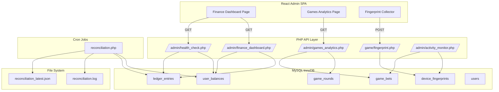

# Design Document — Platform Observability

## Overview

This design covers five observability and integrity features for the anora.bet platform:

1. **Device Fingerprinting** — schema, collection endpoint, frontend canvas hashing, and anti-fraud rules integrated into the existing Activity Monitor.
2. **Admin Finance Dashboard** — backend aggregation endpoint + React page with metric cards and health check integration.
3. **Global Balance Reconciliation Cron Job** — periodic verification of the global balance invariant with JSON alerting output.
4. **Admin Games Analytics / RTP** — backend endpoint with paginated round data, RTP calculations, and a React page with filters and drill-down.
5. **Runtime Monetary Invariants Health Check** — on-demand endpoint verifying three core invariants (no money created, no money lost, everything traceable).

All backend work follows existing patterns: stateless PHP endpoints under `backend/api/`, session-based auth via `requireAdmin()` / `requireLogin()`, MySQL InnoDB with `PDO`, and the existing `LedgerService` for financial data. Frontend work extends the React admin panel with new sidebar links, pages, and API client methods.

## Architecture



### Key Design Decisions

1. **No new service classes** — Each endpoint is a self-contained PHP script following the existing pattern (e.g., `system_balance.php`, `ledger.php`). The queries are straightforward aggregations that don't warrant a service abstraction.

2. **Fingerprint storage is append-only** — Like `ledger_entries`, fingerprint rows are never updated or deleted. This preserves the full audit trail for anti-fraud analysis.

3. **Health check reuses reconciliation logic** — Both the cron job and the health check endpoint verify the same invariants. The health check endpoint runs the checks inline (no shared PHP class needed since the queries are simple and self-contained).

4. **RTP computed from `game_rounds` columns** — The `winner_net`, `total_pot`, and `commission` columns already stored on finished rounds provide all data needed for RTP calculation without re-aggregating from `ledger_entries`.

5. **Canvas fingerprint via SHA-256** — The frontend renders a predefined string to a `<canvas>` element and hashes the `toDataURL()` output. This is a well-known browser fingerprinting technique that produces a stable hash per device/browser combination.

6. **Reconciliation writes both human-readable log and machine-readable JSON** — The log file is for manual inspection; the JSON file enables external monitoring tools to poll and alert.

## Components and Interfaces

### Backend Endpoints

#### `POST /backend/api/game/fingerprint.php`
- **Auth**: `requireLogin()` (HTTP 401 if no session)
- **Input**: `{ "canvas_hash": "string|null" }`
- **Action**: Insert row into `device_fingerprints` with `user_id` from session, `session_id` from `session_id()`, `ip_address` from `$_SERVER['REMOTE_ADDR']`, `user_agent` from `$_SERVER['HTTP_USER_AGENT']`, and provided `canvas_hash`.
- **Output**: `{ "ok": true }`

#### `GET /backend/api/admin/finance_dashboard.php`
- **Auth**: `requireAdmin()` (HTTP 403 if not admin)
- **Output**:
```json
{
  "total_deposits": 12345.67,
  "total_withdrawals": 5432.10,
  "system_profit": 890.12,
  "net_platform_position": 6913.57,
  "total_bets_volume": 45678.00,
  "total_payouts_volume": 43210.00
}
```

#### `GET /backend/api/admin/games_analytics.php`
- **Auth**: `requireAdmin()` (HTTP 403 if not admin)
- **Query params**: `room`, `date_from`, `date_to`, `page`, `per_page` (default 20), `round_id`
- **Output (list mode)**:
```json
{
  "rounds": [
    {
      "id": 1, "room": 1, "total_pot": 5.00, "winner_id": 42,
      "winner_name": "Lucky Storm", "winner_net": 4.85,
      "commission": 0.10, "referral_bonus": 0.05,
      "finished_at": "2025-01-01 12:00:00", "player_count": 3
    }
  ],
  "global_rtp": 97.0,
  "rtp_by_room": { "1": 97.0, "10": 96.5, "100": 97.2 },
  "total_rounds": 150,
  "total_pot_sum": 1500.00,
  "total_payout_sum": 1455.00,
  "page": 1,
  "per_page": 20,
  "total_pages": 8
}
```
- **Output (detail mode, `round_id` provided)**:
```json
{
  "round": {
    "id": 1, "room": 1, "total_pot": 5.00, "winner_id": 42,
    "winner_name": "Lucky Storm", "winner_net": 4.85,
    "commission": 0.10, "referral_bonus": 0.05,
    "finished_at": "2025-01-01 12:00:00",
    "server_seed": "abc...", "final_combined_hash": "def..."
  },
  "bets": [
    { "user_id": 42, "display_name": "Lucky Storm", "amount": 1.00, "chance": 0.2, "client_seed": "123-456-789-012" }
  ]
}
```

#### `GET /backend/api/admin/health_check.php`
- **Auth**: `requireAdmin()` (HTTP 403 if not admin)
- **Output**:
```json
{
  "status": "ok",
  "checks": {
    "no_money_created": { "passed": true, "details": { "sum_balances": 1234.56, "sum_credits": 5678.90, "sum_debits": 4444.34, "expected": 1234.56, "discrepancy": 0.00 } },
    "no_money_lost": { "passed": true, "mismatched_users": [] },
    "everything_traceable": { "passed": true, "untraceable_count": 0 }
  },
  "checked_at": "2025-01-01T12:00:00+00:00"
}
```

#### Updated `GET /backend/api/admin/activity_monitor.php`
- Existing endpoint extended with four new flag types: `multi_account_ip`, `canvas_correlation`, `anomalous_win_rate`, `rapid_bet_speed`.
- New flags appended to the existing `$flags` array before the final `json_encode`.

### Cron Job

#### `backend/cron/reconciliation.php`
- **Execution**: `php backend/cron/reconciliation.php` via crontab (e.g., every 5 minutes)
- **Outputs**:
  - Appends timestamped entries to `backend/logs/reconciliation.log`
  - Overwrites `backend/logs/reconciliation_latest.json` with latest run summary
- **Exit codes**: 0 = all checks pass, 1 = any discrepancy detected

### Frontend Components

#### `FinanceDashboard.jsx` (`/admin/finance`)
- Fetches from `finance_dashboard.php` and `health_check.php` on mount
- Displays 6 metric cards (deposits, withdrawals, system profit, net position, bets volume, payouts volume)
- Displays Platform Health section with 3 invariant check indicators
- Refresh and Re-check buttons

#### `GamesAnalytics.jsx` (`/admin/games-analytics`)
- Fetches from `games_analytics.php` with filter params
- RTP summary cards (global + per-room)
- Paginated rounds table with expandable row detail
- Room selector and date range filters

#### Fingerprint Collector (in `App.jsx` or auth flow)
- On successful login, computes canvas hash via `<canvas>` + SHA-256
- POSTs to `fingerprint.php` once per session (tracked via `sessionStorage` flag)
- Failures logged to console, never block user flow

### Admin Layout Changes
- Two new `NavLink` entries in `AdminLayout.jsx` sidebar: "Finance Dashboard" → `/admin/finance`, "Games Analytics" → `/admin/games-analytics`
- Two new `Route` entries in the `Routes` block
- Two new lazy imports

### API Client Changes (`frontend/src/api/client.js`)
New methods:
```js
adminFinanceDashboard: () => request('/admin/finance_dashboard.php'),
adminGamesAnalytics: (params = {}) => {
  const qs = new URLSearchParams(params).toString();
  return request(`/admin/games_analytics.php?${qs}`);
},
adminGamesAnalyticsDetail: (roundId) => request(`/admin/games_analytics.php?round_id=${roundId}`),
adminHealthCheck: () => request('/admin/health_check.php'),
submitFingerprint: (canvasHash) => request('/game/fingerprint.php', {
  method: 'POST',
  body: JSON.stringify({ canvas_hash: canvasHash }),
}),
```

## Data Models

### New Table: `device_fingerprints`

```sql
CREATE TABLE device_fingerprints (
    id          INT AUTO_INCREMENT PRIMARY KEY,
    user_id     INT NOT NULL,
    session_id  VARCHAR(128) NOT NULL,
    ip_address  VARCHAR(45) NOT NULL,
    user_agent  TEXT NOT NULL,
    canvas_hash VARCHAR(64) DEFAULT NULL,
    created_at  DATETIME NOT NULL DEFAULT CURRENT_TIMESTAMP,
    FOREIGN KEY (user_id) REFERENCES users(id) ON DELETE CASCADE,
    INDEX idx_user_id (user_id),
    INDEX idx_ip_address (ip_address),
    INDEX idx_canvas_hash (canvas_hash),
    INDEX idx_created_at (created_at)
);
```

### Existing Tables Used (no schema changes)

| Table | Usage |
|-------|-------|
| `ledger_entries` | Finance dashboard aggregations, reconciliation checks, traceability check |
| `user_balances` | Reconciliation global sum, per-user balance verification |
| `game_rounds` | Games analytics round listing, RTP calculation |
| `game_bets` | Games analytics detail view, rapid bet speed detection |
| `users` | Bot exclusion (`is_bot = 0`), display names, fraud flags |

### Log File Schemas

#### `backend/logs/reconciliation.log` (append-only, human-readable)
```
[2025-01-01 12:00:00] OK — sum_balances=1234.56 sum_credits=5678.90 sum_debits=4444.34 expected=1234.56 discrepancy=0.00 per_user_mismatches=0
[2025-01-01 12:05:00] CRITICAL — sum_balances=1234.56 sum_credits=5678.90 sum_debits=4444.33 expected=1234.57 discrepancy=0.01 per_user_mismatches=1
```

#### `backend/logs/reconciliation_latest.json` (overwritten each run)
```json
{
  "status": "ok",
  "sum_user_balances": 1234.56,
  "sum_credits": 5678.90,
  "sum_debits": 4444.34,
  "expected_balance": 1234.56,
  "discrepancy": 0.00,
  "per_user_mismatches": 0,
  "checked_at": "2025-01-01T12:00:00+00:00"
}
```

## Correctness Properties

*A property is a characteristic or behavior that should hold true across all valid executions of a system — essentially, a formal statement about what the system should do. Properties serve as the bridge between human-readable specifications and machine-verifiable correctness guarantees.*

### Property 1: Fingerprint Insertion Round-Trip

*For any* authenticated user and any canvas_hash string (including null), submitting a fingerprint via the POST endpoint and then querying `device_fingerprints` for that user's most recent row should return a row whose `user_id`, `ip_address`, `user_agent`, and `canvas_hash` match the submission context.

**Validates: Requirements 1.3**

### Property 2: Multi-Account IP Flag Detection

*For any* set of `device_fingerprints` rows where 3 or more distinct non-bot user IDs share the same `ip_address` within the last 7 days, the Activity Monitor flag output should contain at least one `multi_account_ip` flag for that IP, and each flag should include `user_id`, `email`, `flag_type`, `details`, and `timestamp` fields.

**Validates: Requirements 2.1, 2.5**

### Property 3: Canvas Correlation Flag Detection

*For any* set of `device_fingerprints` rows where 2 or more distinct non-bot user IDs share the same non-null `canvas_hash`, the Activity Monitor flag output should contain at least one `canvas_correlation` flag, and each flag should include `user_id`, `email`, `flag_type`, `details`, and `timestamp` fields.

**Validates: Requirements 2.2, 2.5**

### Property 4: Anomalous Win Rate Flag Detection

*For any* non-bot user whose win count divided by total rounds participated exceeds 40% over the last 100 rounds, the Activity Monitor flag output should contain an `anomalous_win_rate` flag for that user with `user_id`, `email`, `flag_type`, `details`, and `timestamp` fields.

**Validates: Requirements 2.3, 2.5**

### Property 5: Rapid Bet Speed Flag Detection

*For any* non-bot user who has 10 or more `game_bets` rows within any 10-second window, the Activity Monitor flag output should contain a `rapid_bet_speed` flag for that user with `user_id`, `email`, `flag_type`, `details`, and `timestamp` fields.

**Validates: Requirements 2.4, 2.5**

### Property 6: Finance Dashboard Aggregations

*For any* set of `ledger_entries` rows with associated `users` rows, the finance dashboard should return: `total_deposits` equal to the sum of amounts where type IN ('deposit','crypto_deposit') AND direction='credit' AND user is_bot=0; `total_withdrawals` equal to the sum where type IN ('withdrawal','crypto_withdrawal') AND direction='debit' AND is_bot=0; `net_platform_position` equal to `total_deposits - total_withdrawals`; `total_bets_volume` equal to the sum where type='bet' AND direction='debit' AND is_bot=0; `total_payouts_volume` equal to the sum where type='win' AND direction='credit' AND is_bot=0.

**Validates: Requirements 3.2, 3.3, 3.5, 3.6, 3.7**

### Property 7: USD Currency Formatting

*For any* non-negative floating-point number, the currency formatting function should produce a string with exactly two decimal places prefixed by a dollar sign (e.g., `$1,234.56`).

**Validates: Requirements 4.3**

### Property 8: Global Balance Invariant Check

*For any* database state where `SUM(user_balances.balance)` equals `SUM(ledger_entries.amount WHERE direction='credit') - SUM(ledger_entries.amount WHERE direction='debit')` within a tolerance of 0.01, the "no money created" check should return `passed: true`. For any state where the discrepancy exceeds 0.01, the check should return `passed: false` with the discrepancy amount.

**Validates: Requirements 5.5, 8.2**

### Property 9: Per-User Balance Consistency Check

*For any* user who has at least one `ledger_entries` row, if `user_balances.balance` equals the `balance_after` of their most recent `ledger_entries` row (by id DESC) within a tolerance of 0.01, the "no money lost" check should not flag that user. If the values differ beyond tolerance, the check should flag that user with both the actual and expected values.

**Validates: Requirements 5.8, 8.3**

### Property 10: Everything Traceable Check

*For any* set of `ledger_entries` rows, the "everything traceable" check should return `passed: true` if and only if every row has non-null and non-empty `reference_id` and `reference_type` values. If any row has null or empty values, the check should return `passed: false` with the count of untraceable entries.

**Validates: Requirements 8.4**

### Property 11: Health Check Status Reflects Check Results

*For any* combination of the three invariant check results (no_money_created, no_money_lost, everything_traceable), the health check `status` field should be `"ok"` if and only if all three checks have `passed: true`. If any check has `passed: false`, the status should be `"fail"`.

**Validates: Requirements 8.6, 8.7**

### Property 12: RTP Computation Correctness

*For any* set of finished `game_rounds` rows with non-zero `total_pot`, the `global_rtp` should equal `(SUM(winner_net) / SUM(total_pot)) * 100`. For each room value (1, 10, 100), the `rtp_by_room` entry should equal the same formula applied only to rounds in that room. The `total_rounds` should equal the count of matching rounds, `total_pot_sum` should equal `SUM(total_pot)`, and `total_payout_sum` should equal `SUM(winner_net)`.

**Validates: Requirements 6.4, 6.5, 6.6**

### Property 13: Reconciliation Output Reflects Invariant Results

*For any* reconciliation run, the JSON output file should contain `status`, `sum_user_balances`, `sum_credits`, `sum_debits`, `expected_balance`, `discrepancy`, `per_user_mismatches`, and `checked_at` fields. The `status` should be `"ok"` when discrepancy ≤ 0.01 and per_user_mismatches = 0, and `"fail"` otherwise. The exit code should be 0 when status is `"ok"` and 1 when status is `"fail"`.

**Validates: Requirements 10.1, 10.2, 10.3, 10.4, 10.5**

## Error Handling

| Scenario | Behavior |
|----------|----------|
| Fingerprint endpoint called without session | HTTP 401 Unauthorized, `{"error": "Unauthenticated"}` |
| Admin endpoints called without admin session | HTTP 403 Forbidden, `{"error": "Forbidden"}` |
| Fingerprint POST with missing/invalid JSON body | Insert row with `canvas_hash = NULL`, still record IP/UA/session |
| Finance dashboard query fails (DB error) | HTTP 500, `{"error": "Internal server error"}`, log exception |
| Games analytics with invalid room parameter | Ignore filter, return all rooms |
| Games analytics with invalid date range | Ignore date filter, return unfiltered |
| Games analytics with non-existent round_id | Return `{"error": "Round not found"}`, HTTP 404 |
| Health check DB query failure | Return `"status": "fail"` with error details in the failing check |
| Reconciliation cron cannot connect to DB | Log error to stderr, exit code 1, write fail status to JSON |
| Reconciliation log directory doesn't exist | Create `backend/logs/` directory if missing |
| Frontend fingerprint submission fails | `console.error()`, continue normal operation, never block user |
| Frontend finance/analytics API call fails | Display error message in the page, allow retry via Refresh button |
| Activity monitor fingerprint queries on empty `device_fingerprints` table | Return no fingerprint-based flags (empty result set is valid) |

## Testing Strategy

### Property-Based Testing

- **Library**: PHPUnit with manual randomized iteration loops (matching existing project pattern in `CleanupRetentionPropertyTest.php`)
- **Minimum iterations**: 100 per property test
- **Database**: In-memory SQLite for isolation (matching existing pattern)
- **Tag format**: `Feature: platform-observability, Property {N}: {title}`

Each correctness property (1–13) maps to exactly one property-based test. The tests generate random input data (ledger entries, fingerprint records, game rounds, etc.) and verify the property holds across all generated inputs.

### Unit Tests

Unit tests complement property tests by covering:
- Specific examples: known-good finance dashboard response with fixed data
- Edge cases: empty tables, single user, zero-pot rounds, null canvas_hash
- Access control: 401/403 responses for unauthenticated/non-admin requests
- Error conditions: invalid round_id, malformed request bodies
- Integration points: activity monitor returns both old and new flag types in same array

### Test Files

| Test File | Properties Covered |
|-----------|-------------------|
| `tests/FingerprintPropertyTest.php` | Property 1 |
| `tests/ActivityMonitorFlagsPropertyTest.php` | Properties 2, 3, 4, 5 |
| `tests/FinanceDashboardPropertyTest.php` | Properties 6, 7 |
| `tests/InvariantCheckPropertyTest.php` | Properties 8, 9, 10, 11 |
| `tests/RtpComputationPropertyTest.php` | Property 12 |
| `tests/ReconciliationPropertyTest.php` | Property 13 |
