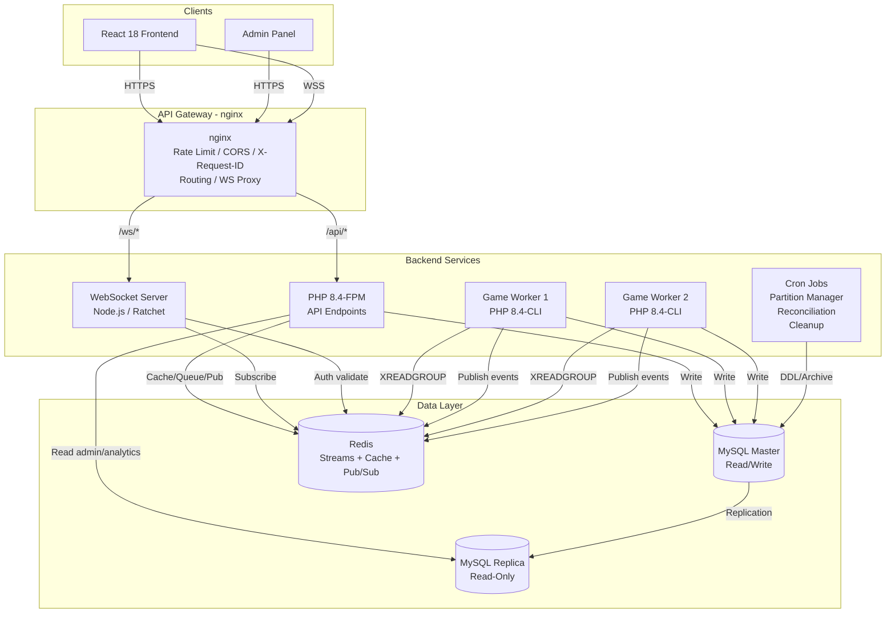
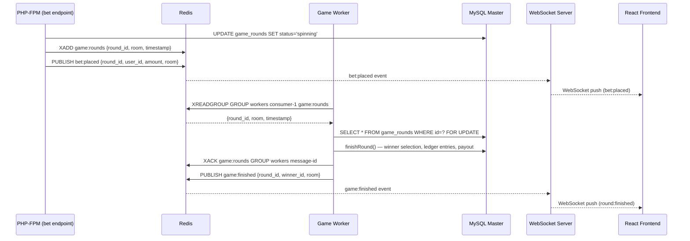
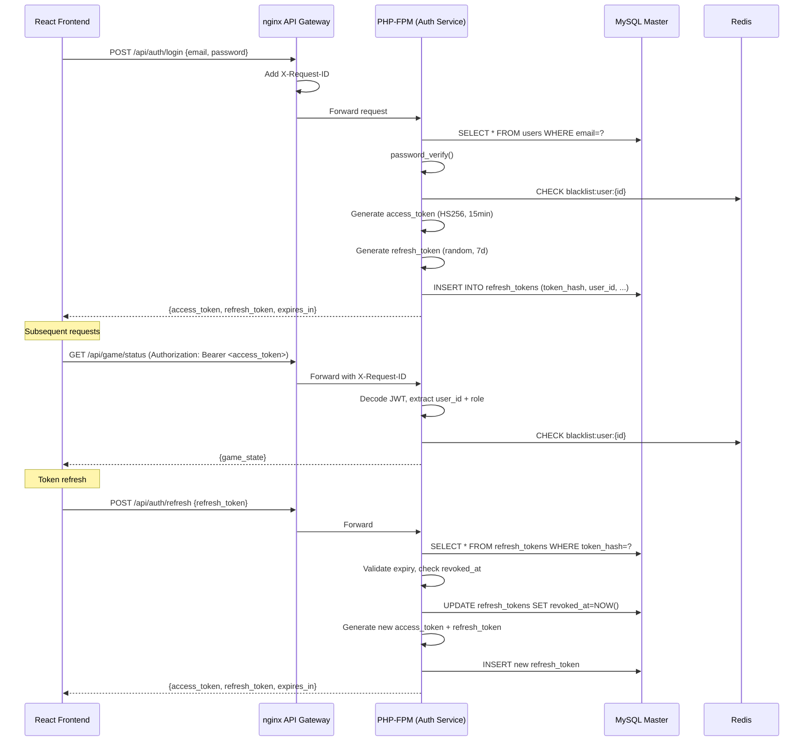

# Дизайн-документ: Production Architecture Overhaul

## Обзор

Данный документ описывает техническое проектирование инкрементального усиления архитектуры платформы ANORA. Текущая архитектура — PHP 8.4 монолит с MySQL 8 InnoDB, React 18 фронтендом, ledger-based балансовой системой, provably fair игровым движком и crypto-платежами через NOWPayments.

Ключевые изменения:
- Замена PHP-сессий на JWT-аутентификацию (stateless)
- Внедрение Redis как message broker (Streams) и кэш-слоя
- Замена `while(true)` game_worker на queue-based архитектуру с consumer groups
- WebSocket-сервер для real-time push-уведомлений
- nginx API Gateway с централизованным rate limiting, CORS, трассировкой
- Структурированное JSON-логирование
- Партиционирование ledger_entries и game_bets по месяцам
- Read replicas для разгрузки SELECT-запросов
- Docker-контейнеризация всех компонентов

Все изменения инкрементальны — существующие механизмы (ledger idempotency, FOR UPDATE locking, HMAC-SHA512 webhook validation, anti-fraud flags, reconciliation) сохраняются без изменений.

## Архитектура

### Высокоуровневая диаграмма



### Диаграмма последовательности: Игровой раунд (finish_round)



### Диаграмма последовательности: JWT Authentication Flow



## Компоненты и интерфейсы

### 1. Auth_Service (JWT)

Заменяет текущий `backend/includes/auth.php` (session-based `requireLogin()` / `requireAdmin()`).

**Новые файлы:**
- `backend/includes/jwt_service.php` — класс `JwtService` (выпуск, валидация, refresh rotation)
- `backend/includes/auth_middleware.php` — замена `requireLogin()` / `requireAdmin()` на JWT-based

**API контракты:**

```
POST /api/auth/login
  Request:  { "email": string, "password": string }
  Response: { "access_token": string, "refresh_token": string, "expires_in": 900 }

POST /api/auth/refresh
  Request:  { "refresh_token": string }
  Response: { "access_token": string, "refresh_token": string, "expires_in": 900 }

POST /api/auth/logout
  Request:  (Authorization: Bearer <access_token>)
  Response: { "success": true }
```

**JWT Payload:**
```json
{
  "sub": 42,
  "role": "user|admin",
  "iat": 1700000000,
  "exp": 1700000900,
  "jti": "uuid-v4"
}
```

**Решение:** HS256 вместо RS256 — достаточно для монолитной архитектуры, где один сервис и выпускает, и валидирует токены. Секрет хранится в `.env` (JWT_SECRET), не в коде.

### 2. Redis_Broker (Streams + Pub/Sub)

**Новые файлы:**
- `backend/includes/redis_client.php` — singleton-обёртка над phpredis с graceful degradation
- `backend/includes/queue_service.php` — класс `QueueService` (XADD, XREADGROUP, XACK, XCLAIM)

**Redis Streams:**
- Stream: `game:rounds` — задачи finish_round
- Consumer Group: `workers`
- Consumer Name: `{hostname}-{pid}`

**Pub/Sub каналы:**
- `game:finished` — событие завершения раунда
- `bet:placed` — событие новой ставки
- `admin:events` — агрегированные события для admin panel

### 3. Redis_Cache

**Новые файлы:**
- `backend/includes/cache_service.php` — класс `CacheService` (get/set/invalidate с TTL)

**Схема ключей Redis:**

| Ключ | Тип | TTL | Описание |
|------|-----|-----|----------|
| `game:state:{room}` | STRING (JSON) | 5s | Кэш текущего состояния раунда |
| `admin:dashboard` | STRING (JSON) | 30s | Кэш финансового дашборда |
| `ratelimit:bet:{user_id}` | STRING (counter) | 60s | Счётчик ставок в минуту |
| `ratelimit:bet_sec:{user_id}` | STRING (counter) | 1s | Счётчик ставок в секунду |
| `ratelimit:deposit:{user_id}` | STRING (counter) | 3600s | Счётчик депозитов в час |
| `ratelimit:withdraw:{user_id}` | STRING (counter) | 3600s | Счётчик выводов в час |
| `blacklist:user:{user_id}` | STRING | ∞ | Забаненные пользователи |
| `worker:{name}:heartbeat` | STRING | 30s | Heartbeat воркера |
| `refresh:family:{user_id}:{family_id}` | STRING | 7d | Семейство refresh-токенов для replay detection |

### 4. WebSocket_Server

**Решение:** Node.js (ws library) — лучшая экосистема для WebSocket, проще интеграция с Redis Pub/Sub через ioredis. PHP Ratchet возможен, но Node.js более зрелый для этой задачи.

**Новые файлы:**
- `websocket/server.js` — WebSocket-сервер
- `websocket/package.json` — зависимости (ws, ioredis, jsonwebtoken)

**Каналы:**
- `game:{room}` — игровые события для комнаты (1, 10, 100)
- `admin:live` — мониторинг для администраторов

**Лимиты подключений:**
- 1000 на `game:{room}`
- 50 на `admin:live`

**Протокол подключения:**
```
ws://host/ws/game/10?token=<jwt_access_token>
ws://host/ws/admin/live?token=<jwt_access_token>
```

**События (JSON):**
```json
{"event": "bet:placed", "data": {"round_id": 123, "user_id": 42, "amount": 10, "room": 10}}
{"event": "round:finished", "data": {"round_id": 123, "winner_id": 42, "room": 10, "winner_net": 85.50}}
```

### 5. API_Gateway (nginx)

Заменяет текущий `.osp/ngnix/anora.local.conf` и `backend/includes/cors.php`.

**Новый файл:**
- `docker/nginx/nginx.conf` — полная конфигурация API Gateway

**Маршрутизация:**

| Префикс | Upstream | Описание |
|---------|----------|----------|
| `/api/auth/*` | php-fpm:9000 | Аутентификация |
| `/api/game/*` | php-fpm:9000 | Игровые эндпоинты |
| `/api/account/*` | php-fpm:9000 | Кошелёк |
| `/api/webhook/*` | php-fpm:9000 | Платёжные вебхуки |
| `/api/admin/*` | php-fpm:9000 | Админ-панель |
| `/ws/*` | websocket:8080 | WebSocket upgrade |
| `/*` | static files | React SPA |

**Rate Limiting:**
- Глобальный: 100 req/min на IP (неаутентифицированные)
- Реализация: nginx `limit_req_zone` с `$binary_remote_addr`

**Заголовки:**
- `X-Request-ID`: UUID v4 (генерируется nginx через `$request_id` или lua)
- CORS: централизованная обработка в nginx, `backend/includes/cors.php` удаляется

**Таймаут:** 10 секунд на upstream, HTTP 504 с JSON `{"error": "Service unavailable"}`

### 6. Structured_Logger

**Новые файлы:**
- `backend/includes/structured_logger.php` — класс `StructuredLogger`

**Формат записи (stdout/stderr):**
```json
{
  "timestamp": "2024-01-15T12:30:45.123Z",
  "level": "info",
  "message": "Ledger entry created",
  "context": {
    "user_id": 42,
    "request_id": "550e8400-e29b-41d4-a716-446655440000",
    "trace_id": "abc123"
  },
  "source": "ledger_service.php:87",
  "data": {
    "type": "bet",
    "amount": 10.00,
    "direction": "debit",
    "balance_after": 90.00,
    "reference_id": "123:42:1"
  }
}
```

**Уровни:** debug, info, warning, error, critical
**Фильтрация:** через переменную окружения `LOG_LEVEL` (по умолчанию: info)

**Audit-лог (security events):**
```json
{
  "timestamp": "...",
  "level": "info",
  "message": "Security event",
  "context": {"user_id": 42, "request_id": "..."},
  "audit": {
    "action": "login",
    "ip_address": "1.2.3.4",
    "user_agent": "Mozilla/5.0...",
    "result": "success"
  }
}
```

### 7. Partition_Manager

**Новые файлы:**
- `backend/cron/partition_manager.php` — скрипт создания/архивации партиций

**Стратегия:** RANGE COLUMNS по `created_at` с интервалом 1 месяц.

**Миграция существующих данных:**
Используем `ALTER TABLE ... PARTITION BY RANGE COLUMNS(created_at)` — MySQL 8 поддерживает online DDL для партиционирования. Для таблиц с foreign keys (game_bets → game_rounds) потребуется предварительное удаление FK constraint, партиционирование, затем восстановление через application-level enforcement.

**Важно:** MySQL не поддерживает foreign keys на партиционированных таблицах. Для `ledger_entries` и `game_bets` FK constraints будут заменены на application-level проверки (которые уже существуют в `LedgerService` и `GameEngine`).

### 8. Read Replicas (PDO Split)

**Изменения в:**
- `backend/config/db.php` — два PDO-подключения: `$pdo_write`, `$pdo_read`

**Логика маршрутизации:**
- `$pdo_write`: все INSERT/UPDATE/DELETE, финансовые SELECT (баланс при ставке)
- `$pdo_read`: SELECT для admin dashboard, analytics, ledger explorer, game history
- Fallback: если replica недоступна → `$pdo_read = $pdo_write` + warning в лог
- Replication lag check: `SHOW SLAVE STATUS` → `Seconds_Behind_Master` > 5 → критические SELECT на master

### 9. Game_Worker (горизонтальное масштабирование)

**Изменения в:**
- `backend/game_worker.php` — полная переработка: Redis Streams вместо while(true) + MySQL polling

**Новая архитектура:**
```
Game_Worker:
  1. XREADGROUP GROUP workers {consumer_name} BLOCK 5000 game:rounds >
  2. Получить задачу {round_id, room}
  3. finishRound(round_id) — существующая логика GameEngine
  4. XACK game:rounds workers {message_id}
  5. PUBLISH game:finished {round_id, winner_id, room}
  6. SETEX worker:{name}:heartbeat 30 alive (каждые 10 секунд)
```

**Consumer name:** `{hostname}-{pid}` (уникальный для каждого экземпляра)

**Graceful shutdown:** SIGTERM → завершить текущую задачу → XACK → exit

**Dead worker recovery:**
- Отдельный cron/процесс проверяет `worker:{name}:heartbeat`
- Если heartbeat отсутствует > 30s → `XCLAIM` pending-задач мёртвого воркера

### 10. Docker-контейнеризация

**Новые файлы:**
- `docker/php-fpm/Dockerfile` — PHP 8.4-fpm + pdo_mysql, redis, pcntl
- `docker/game-worker/Dockerfile` — PHP 8.4-cli + pdo_mysql, redis, pcntl
- `docker/nginx/Dockerfile` — nginx + конфигурация API Gateway
- `docker/nginx/nginx.conf` — конфигурация
- `docker/websocket/Dockerfile` — Node.js + ws + ioredis
- `docker-compose.yml` — оркестрация всех сервисов
- `.env.example` — шаблон переменных окружения

**Сервисы в docker-compose.yml:**

| Сервис | Образ | Реплики | Порты |
|--------|-------|---------|-------|
| nginx | custom | 1 | 80, 443 |
| php-fpm | custom | 1 | 9000 (internal) |
| game-worker | custom | 2 | — |
| redis | redis:7-alpine | 1 | 6379 (internal) |
| mysql | mysql:8.0 | 1 | 3306 (internal) |
| websocket | custom | 1 | 8080 (internal) |

**Volumes:**
- `mysql_data` — MySQL data directory
- `redis_data` — Redis AOF persistence
- `logs` — application logs

## Модели данных

### Новые таблицы

#### refresh_tokens
```sql
CREATE TABLE refresh_tokens (
    id          INT AUTO_INCREMENT PRIMARY KEY,
    token_hash  VARCHAR(64) NOT NULL UNIQUE,
    user_id     INT NOT NULL,
    family_id   VARCHAR(36) NOT NULL,
    device_fingerprint VARCHAR(64) DEFAULT NULL,
    expires_at  DATETIME NOT NULL,
    revoked_at  DATETIME DEFAULT NULL,
    created_at  DATETIME NOT NULL DEFAULT CURRENT_TIMESTAMP,
    INDEX idx_user_id (user_id),
    INDEX idx_family_id (family_id),
    INDEX idx_expires_at (expires_at),
    FOREIGN KEY (user_id) REFERENCES users(id) ON DELETE CASCADE
);
```

`family_id` — UUID, объединяющий цепочку refresh-токенов. При replay attack (повторное использование уже revoked токена) — инвалидируются все токены с тем же `family_id`.

#### structured_logs (опционально, для MySQL-based log storage)
Основной вывод — stdout/stderr. Таблица опциональна для audit-логов:
```sql
CREATE TABLE audit_logs (
    id          BIGINT AUTO_INCREMENT PRIMARY KEY,
    timestamp   DATETIME(3) NOT NULL DEFAULT CURRENT_TIMESTAMP(3),
    level       ENUM('debug','info','warning','error','critical') NOT NULL,
    action      VARCHAR(64) NOT NULL,
    user_id     INT DEFAULT NULL,
    ip_address  VARCHAR(45) DEFAULT NULL,
    user_agent  TEXT DEFAULT NULL,
    request_id  VARCHAR(36) DEFAULT NULL,
    result      ENUM('success','failure') DEFAULT NULL,
    context     JSON DEFAULT NULL,
    INDEX idx_user_id (user_id),
    INDEX idx_action (action),
    INDEX idx_timestamp (timestamp)
);
```

### Партиционирование существующих таблиц

#### ledger_entries (партиционирование по месяцам)
```sql
ALTER TABLE ledger_entries
    DROP FOREIGN KEY IF EXISTS ledger_entries_ibfk_1,
    PARTITION BY RANGE COLUMNS(created_at) (
        PARTITION p2024_01 VALUES LESS THAN ('2024-02-01'),
        PARTITION p2024_02 VALUES LESS THAN ('2024-03-01'),
        -- ... автоматически создаются на 3 месяца вперёд
        PARTITION p_future VALUES LESS THAN MAXVALUE
    );
```

#### game_bets (партиционирование по месяцам)
```sql
ALTER TABLE game_bets
    DROP FOREIGN KEY IF EXISTS game_bets_ibfk_1,
    DROP FOREIGN KEY IF EXISTS game_bets_ibfk_2,
    PARTITION BY RANGE COLUMNS(created_at) (
        PARTITION p2024_01 VALUES LESS THAN ('2024-02-01'),
        PARTITION p2024_02 VALUES LESS THAN ('2024-03-01'),
        -- ... автоматически создаются на 3 месяца вперёд
        PARTITION p_future VALUES LESS THAN MAXVALUE
    );
```

### Схема Redis-ключей (полная)

```
# Auth
blacklist:user:{user_id}                → "1" (no TTL, manual removal)
refresh:family:{user_id}:{family_id}    → token_count (TTL 7d)

# Game Cache
game:state:{room}                       → JSON game state (TTL 5s)

# Admin Cache
admin:dashboard                         → JSON dashboard data (TTL 30s)

# Rate Limiting
ratelimit:bet:{user_id}                 → counter (TTL 60s)
ratelimit:bet_sec:{user_id}             → counter (TTL 1s)
ratelimit:deposit:{user_id}             → counter (TTL 3600s)
ratelimit:withdraw:{user_id}            → counter (TTL 3600s)

# Streams
game:rounds                             → Redis Stream (consumer group: workers)

# Pub/Sub Channels
game:finished                           → {round_id, winner_id, room}
bet:placed                              → {round_id, user_id, amount, room}
admin:events                            → aggregated events

# Worker Health
worker:{name}:heartbeat                 → "alive" (TTL 30s, SETEX every 10s)
```

### Изменения в backend/config/db.php

```php
<?php
// Read from environment variables (Docker .env)
$db_write_host = getenv('DB_WRITE_HOST') ?: 'mysql';
$db_read_host  = getenv('DB_READ_HOST') ?: $db_write_host;
$db_user       = getenv('DB_USER') ?: 'anora';
$db_pass       = getenv('DB_PASS') ?: '';
$db_name       = getenv('DB_NAME') ?: 'anora';

$pdo_write = new PDO(
    "mysql:host={$db_write_host};dbname={$db_name};charset=utf8mb4",
    $db_user, $db_pass,
    [PDO::ATTR_ERRMODE => PDO::ERRMODE_EXCEPTION, PDO::ATTR_DEFAULT_FETCH_MODE => PDO::FETCH_ASSOC]
);

try {
    $pdo_read = new PDO(
        "mysql:host={$db_read_host};dbname={$db_name};charset=utf8mb4",
        $db_user, $db_pass,
        [PDO::ATTR_ERRMODE => PDO::ERRMODE_EXCEPTION, PDO::ATTR_DEFAULT_FETCH_MODE => PDO::FETCH_ASSOC]
    );
} catch (PDOException $e) {
    // Graceful degradation: fallback to master
    $pdo_read = $pdo_write;
    error_log("[DB] Read replica unavailable, falling back to master: " . $e->getMessage());
}

// Backward compatibility
$pdo = $pdo_write;
```


## Correctness Properties

*Свойство корректности (property) — это характеристика или поведение, которое должно выполняться для всех допустимых входных данных системы. Свойства служат мостом между человекочитаемыми спецификациями и машинно-верифицируемыми гарантиями корректности.*

### Property 1: JWT encode/decode round-trip

*For any* valid user_id (positive integer) and role ("user" or "admin"), encoding a JWT with these claims and then decoding it should return the same user_id and role. The decoded `exp` claim should equal `iat + 900` (15 minutes).

**Validates: Requirements 1.1, 1.2**

### Property 2: Refresh token rotation invalidates old token

*For any* valid user with an active refresh token, calling the refresh endpoint should return a new token pair AND the old refresh token's `revoked_at` in the database should be non-null. Attempting to use the old refresh token again should fail with HTTP 401.

**Validates: Requirements 1.3**

### Property 3: Replay attack invalidates entire token family

*For any* user with a refresh token family (identified by `family_id`), if a revoked refresh token is reused, then ALL refresh tokens with the same `family_id` should have `revoked_at` set to a non-null value.

**Validates: Requirements 1.4**

### Property 4: Blacklisted user tokens are rejected

*For any* user_id present in the Redis blacklist key `blacklist:user:{user_id}`, JWT validation should return failure regardless of whether the token's signature and expiry are valid.

**Validates: Requirements 1.6**

### Property 5: JWT signature tamper detection

*For any* valid JWT token, modifying any single character in the payload portion and then attempting to validate should return failure. Specifically: `validate(tamper(sign(payload, secret), secret)) == false`.

**Validates: Requirements 1.7**

### Property 6: Game worker idempotent processing

*For any* game round in 'spinning' status with `payout_status='pending'`, calling `finishRound()` twice should result in exactly one set of ledger entries (one winner credit, one system fee credit, one referral credit). The second call should return the already-finished round without creating duplicate entries.

**Validates: Requirements 2.5**

### Property 7: State change events published with correct payload

*For any* game state transition (round → spinning, bet placed, round finished), the corresponding Redis Pub/Sub event should contain all required payload fields: `round_id` (positive integer), `room` (one of 1, 10, 100), and event-specific fields (`user_id` + `amount` for bet:placed, `winner_id` for game:finished).

**Validates: Requirements 2.2, 2.6, 4.4**

### Property 8: Cache invalidation on state change

*For any* room with a cached game state (`game:state:{room}` key exists in Redis), when the round state changes (new bet, status transition, round finish), the cache key should be deleted. Immediately after invalidation, `EXISTS game:state:{room}` should return 0.

**Validates: Requirements 3.2**

### Property 9: Rate limit counter accuracy

*For any* sequence of N increment operations on a rate limit key `ratelimit:{type}:{user_id}`, the counter value should equal N. After the TTL expires, the counter should reset to 0 (key does not exist).

**Validates: Requirements 3.4**

### Property 10: Redis unavailability graceful degradation

*For any* cache read operation, if the Redis connection throws an exception, the system should fall back to a direct MySQL query and return a valid result. The operation should not throw an unhandled exception to the caller.

**Validates: Requirements 3.5**

### Property 11: WebSocket JWT authentication

*For any* WebSocket connection attempt, if the provided JWT token is valid (correct signature, not expired, user not blacklisted), the connection should be accepted. If the token is invalid, expired, or the user is blacklisted, the connection should be rejected with close code 4001.

**Validates: Requirements 4.1**

### Property 12: Event routing to correct room subscribers

*For any* Redis Pub/Sub event for channel `game:{room}`, all WebSocket clients subscribed to that room should receive the event, and clients subscribed to different rooms should NOT receive it.

**Validates: Requirements 4.2**

### Property 13: WebSocket connection cleanup on disconnect

*For any* WebSocket client that disconnects (gracefully or abruptly), the client should be removed from all subscription sets. After cleanup, the client should not appear in any room's subscriber list.

**Validates: Requirements 4.6**

### Property 14: WebSocket connection limits enforcement

*For any* channel, if the number of active connections equals the limit (1000 for `game:{room}`, 50 for `admin:live`), the next connection attempt should be rejected. The total connection count should never exceed the configured limit.

**Validates: Requirements 4.7**

### Property 15: Structured log JSON format with required fields

*For any* log message with any level and any context, the output should be valid JSON containing all required top-level fields: `timestamp` (ISO 8601 format), `level` (one of debug/info/warning/error/critical), `message` (non-empty string), `context` (object), `source` (string matching pattern `filename.php:line`).

**Validates: Requirements 6.1**

### Property 16: Log level filtering

*For any* combination of log message level L and configured minimum level M, the message should be output if and only if `severity(L) >= severity(M)`, where severity order is: debug < info < warning < error < critical.

**Validates: Requirements 6.2**

### Property 17: Domain-specific log entries contain required fields

*For any* financial operation log, the `data` object should contain fields: `user_id`, `type`, `amount`, `direction`, `balance_after`, `reference_id`. *For any* security audit log, the `audit` object should contain fields: `action`, `user_id`, `ip_address`, `user_agent`, `result`.

**Validates: Requirements 6.3, 6.7**

### Property 18: Error logs include stack trace

*For any* exception passed to the logger at level `error` or `critical`, the output JSON should contain a `trace` field with a non-empty string representing the stack trace.

**Validates: Requirements 6.4**

### Property 19: Request ID propagation in logs

*For any* HTTP request context where `X-Request-ID` header is set to value V, all log entries produced during that request should have `context.request_id` equal to V.

**Validates: Requirements 6.6**

### Property 20: Partition boundary generation

*For any* date D, the partition manager should generate partition boundaries where each partition covers exactly one calendar month. The partition name should follow the pattern `p{YYYY}_{MM}` and the boundary value should be the first day of the next month.

**Validates: Requirements 7.1, 7.2**

### Property 21: Partition lifecycle date calculations

*For any* current date D, the partition manager should: (a) generate partitions covering months D, D+1, D+2, D+3 (3 months ahead), and (b) identify partitions older than D-12 months as candidates for archival. The set of "create" partitions and "archive" partitions should never overlap.

**Validates: Requirements 7.3, 7.4**

### Property 22: Query routing by operation type

*For any* query context with operation type and caller module, financial write operations (INSERT/UPDATE on ledger_entries, user_balances, crypto_invoices, crypto_payouts) should route to `$pdo_write`, and admin read operations (SELECT for dashboard, analytics, ledger explorer) should route to `$pdo_read`.

**Validates: Requirements 8.2, 8.3**

### Property 23: Read replica fallback on failure

*For any* read query, if the `$pdo_read` connection throws a `PDOException`, the query should be retried on `$pdo_write` and return a valid result without propagating the original exception.

**Validates: Requirements 8.4**

### Property 24: Replication lag routing

*For any* replication lag value L (in seconds), if L > 5, critical read queries (balance check during bet placement) should be routed to `$pdo_write`. If L <= 5, they should be routed to `$pdo_read`.

**Validates: Requirements 8.6**

### Property 25: Dead worker detection and task reclaim

*For any* worker whose heartbeat key `worker:{name}:heartbeat` has expired (TTL reached 0), and that worker has pending messages in the Redis Stream, the recovery process should XCLAIM those messages to an active worker. After XCLAIM, the messages should appear in the active worker's pending list.

**Validates: Requirements 9.5**

## Обработка ошибок

### Стратегия по компонентам

| Компонент | Ошибка | Обработка |
|-----------|--------|-----------|
| Auth_Service | Невалидный JWT | HTTP 401, JSON `{"error": "Invalid token"}` |
| Auth_Service | Истёкший access_token | HTTP 401, JSON `{"error": "Token expired"}` |
| Auth_Service | Replay attack (refresh) | HTTP 401, инвалидация всей семьи токенов, audit-лог |
| Auth_Service | Забаненный пользователь | HTTP 401, JSON `{"error": "Account suspended"}` |
| Redis_Broker | Redis недоступен | Graceful degradation → MySQL fallback, warning в лог |
| Redis_Cache | Cache miss | Прозрачный fallback на MySQL, кэширование результата |
| Redis_Cache | Redis timeout | Пропуск кэша, прямой запрос к MySQL |
| Game_Worker | Deadlock при finishRound | Retry до 3 раз с exponential backoff (существующая логика) |
| Game_Worker | Задача не подтверждена (XACK) | Автоматический re-delivery через 60s (Redis Streams PEL) |
| Game_Worker | Worker crash | Heartbeat expires → XCLAIM pending задач |
| WebSocket | Невалидный JWT при handshake | Close connection с кодом 4001 |
| WebSocket | Превышен лимит подключений | Close connection с кодом 4002, JSON reason |
| WebSocket | Redis Pub/Sub disconnect | Автоматический reconnect с exponential backoff |
| API_Gateway | Backend timeout (>10s) | HTTP 504, JSON `{"error": "Service unavailable"}` |
| API_Gateway | Rate limit exceeded | HTTP 429, JSON `{"error": "Too many requests"}`, Retry-After header |
| DB Read Replica | Replica недоступна | Fallback на master, warning в лог |
| DB Read Replica | Replication lag > 5s | Критические SELECT на master |
| Partition_Manager | Партиция уже существует | Skip, info-лог |
| Partition_Manager | Ошибка DDL | Error-лог, alert, не прерывать остальные операции |

### Принципы

1. **Никогда не терять деньги** — все финансовые операции через LedgerService с idempotency (существующая защита сохраняется)
2. **Graceful degradation** — Redis/Replica недоступны → fallback на MySQL master
3. **Structured logging** — все ошибки логируются в JSON с контекстом (request_id, user_id)
4. **Retry with backoff** — deadlocks, timeouts, transient failures
5. **Circuit breaker pattern** — для Redis и Read Replica (после N ошибок → fallback на определённое время)

## Стратегия тестирования

### Двойной подход

Тестирование использует два взаимодополняющих подхода:

1. **Unit-тесты (PHPUnit)** — конкретные примеры, edge cases, error conditions
2. **Property-based тесты (PHPUnit + mt_rand)** — универсальные свойства на рандомизированных входных данных

Проект уже использует PHPUnit с property-based подходом через `mt_rand()` для генерации случайных данных (см. существующие тесты: `InvariantCheckPropertyTest`, `PayoutEnginePropertyTest`, `ReconciliationPropertyTest` и др.). Новые тесты следуют тому же паттерну.

### Библиотека для property-based тестирования

**PHPUnit** с ручной генерацией через `mt_rand()` — как в существующих тестах проекта. Каждый тест выполняет минимум 100 итераций с рандомизированными входными данными.

### Конфигурация property-based тестов

- Минимум **100 итераций** на каждый property-тест
- Каждый тест помечен комментарием: `Feature: production-architecture-overhaul, Property {N}: {title}`
- Каждый property из раздела Correctness Properties реализуется **одним** property-based тестом
- Тесты используют in-memory SQLite (для DB-зависимых) или mock-объекты (для Redis-зависимых)

### Распределение тестов по файлам

| Файл теста | Properties | Описание |
|------------|------------|----------|
| `JwtServicePropertyTest.php` | P1, P2, P3, P4, P5 | JWT encode/decode, refresh rotation, replay, blacklist, tamper |
| `GameWorkerIdempotencyPropertyTest.php` | P6 | Идемпотентность finishRound |
| `EventPublishingPropertyTest.php` | P7, P8 | Pub/Sub события, cache invalidation |
| `RateLimitPropertyTest.php` | P9 | Точность счётчиков rate limit |
| `GracefulDegradationPropertyTest.php` | P10, P23 | Redis/Replica fallback |
| `WebSocketPropertyTest.php` | P11, P12, P13, P14 | WS auth, routing, cleanup, limits |
| `StructuredLoggerPropertyTest.php` | P15, P16, P17, P18, P19 | Формат логов, фильтрация, поля |
| `PartitionManagerPropertyTest.php` | P20, P21 | Генерация партиций, lifecycle |
| `QueryRoutingPropertyTest.php` | P22, P24 | Маршрутизация запросов, lag routing |
| `WorkerHealthPropertyTest.php` | P25 | Dead worker detection, XCLAIM |

### Unit-тесты (конкретные примеры и edge cases)

Unit-тесты фокусируются на:
- Конкретные сценарии: логин с правильными/неправильными данными, refresh с истёкшим токеном
- Edge cases: пустой payload JWT, нулевой TTL кэша, пустая очередь Redis Stream
- Error conditions: невалидный JSON в webhook, SQL injection в параметрах
- Интеграционные точки: nginx → PHP-FPM, WebSocket → Redis Pub/Sub

Property-тесты покрывают общие правила, unit-тесты — конкретные граничные случаи. Вместе они обеспечивают полное покрытие.
