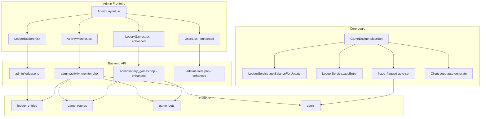

# Design Document — Production Hardening

## Overview

This design closes six production-hardening gaps identified by a security audit of the anora.bet lottery platform. The changes span backend API endpoints, database schema, GameEngine logic, and admin frontend pages. All new endpoints follow the existing pattern: PHP scripts under `backend/api/admin/`, guarded by `requireAdmin()`, returning JSON. Frontend additions follow the existing AdminLayout pattern with NavLink sidebar entries and React page components.

### Scope

| Gap | Backend | Frontend | DB |
|-----|---------|----------|----|
| Admin Ledger Explorer | `admin/ledger.php` | `LedgerExplorer.jsx` | — |
| Suspicious Activity Monitor | `admin/activity_monitor.php` | `ActivityMonitor.jsx` | — |
| Win Streak Auto-Suspension | `game_engine.php` change | `Users.jsx` change | `fraud_flagged` column |
| Fix Race Condition on Bets | `game_engine.php` change | — | — |
| Mandatory Client Seeds | `game_engine.php` change | — | — |
| Admin Round History | `admin/lottery_games.php` change | `LotteryGames.jsx` change | — |

## Architecture



## Components and Interfaces

### 1. Admin Ledger Explorer Backend — `backend/api/admin/ledger.php`

New endpoint. GET only. Guarded by `requireAdmin()`.

**Query parameters:**

| Param | Type | Default | Description |
|-------|------|---------|-------------|
| `page` | int | 1 | Page number |
| `per_page` | int | 50 | Rows per page (max 200) |
| `user_id` | int | — | Filter by user ID |
| `email` | string | — | Filter by user email (partial LIKE match) |
| `type` | string | — | Filter by ledger type |
| `date_from` | string | — | ISO date, inclusive lower bound |
| `date_to` | string | — | ISO date, inclusive upper bound |
| `reference_type` | string | — | Filter by reference_type |
| `reference_id` | string | — | Filter by exact reference_id |

**Response shape:**

```json
{
  "entries": [
    {
      "id": 1,
      "user_id": 42,
      "email": "user@example.com",
      "type": "bet",
      "amount": "10.00",
      "direction": "debit",
      "balance_after": "90.00",
      "reference_id": "5:42:1",
      "reference_type": "game_bet",
      "created_at": "2025-01-15 12:00:00"
    }
  ],
  "page": 1,
  "per_page": 50,
  "total_count": 1234,
  "total_pages": 25
}
```

**Implementation approach:**

```php
// backend/api/admin/ledger.php
session_start();
require_once __DIR__ . '/../../includes/cors.php';
require_once __DIR__ . '/../../config/db.php';
require_once __DIR__ . '/../../includes/auth.php';
requireAdmin();

$page    = max(1, (int)($_GET['page'] ?? 1));
$perPage = min(200, max(1, (int)($_GET['per_page'] ?? 50)));
$offset  = ($page - 1) * $perPage;

$where  = [];
$params = [];

if (!empty($_GET['user_id'])) {
    $where[]  = 'le.user_id = ?';
    $params[] = (int)$_GET['user_id'];
}
if (!empty($_GET['email'])) {
    $where[]  = 'u.email LIKE ?';
    $params[] = '%' . $_GET['email'] . '%';
}
if (!empty($_GET['type'])) {
    $where[]  = 'le.type = ?';
    $params[] = $_GET['type'];
}
if (!empty($_GET['date_from'])) {
    $where[]  = 'le.created_at >= ?';
    $params[] = $_GET['date_from'] . ' 00:00:00';
}
if (!empty($_GET['date_to'])) {
    $where[]  = 'le.created_at <= ?';
    $params[] = $_GET['date_to'] . ' 23:59:59';
}
if (!empty($_GET['reference_type'])) {
    $where[]  = 'le.reference_type = ?';
    $params[] = $_GET['reference_type'];
}
if (!empty($_GET['reference_id'])) {
    $where[]  = 'le.reference_id = ?';
    $params[] = $_GET['reference_id'];
}

$whereSQL = $where ? 'WHERE ' . implode(' AND ', $where) : '';

// Count
$countStmt = $pdo->prepare(
    "SELECT COUNT(*) FROM ledger_entries le JOIN users u ON u.id = le.user_id $whereSQL"
);
$countStmt->execute($params);
$totalCount = (int)$countStmt->fetchColumn();

// Fetch page
$dataStmt = $pdo->prepare(
    "SELECT le.id, le.user_id, u.email, le.type, le.amount, le.direction,
            le.balance_after, le.reference_id, le.reference_type, le.created_at
     FROM ledger_entries le
     JOIN users u ON u.id = le.user_id
     $whereSQL
     ORDER BY le.id DESC
     LIMIT $perPage OFFSET $offset"
);
$dataStmt->execute($params);

echo json_encode([
    'entries'     => $dataStmt->fetchAll(PDO::FETCH_ASSOC),
    'page'        => $page,
    'per_page'    => $perPage,
    'total_count' => $totalCount,
    'total_pages' => (int)ceil($totalCount / $perPage),
]);
```

### 2. Admin Ledger Explorer Frontend — `frontend/src/pages/admin/LedgerExplorer.jsx`

New React component. Added to AdminLayout sidebar and routes.

**Structure:**
- Filter bar: text input for user_id/email, dropdown for type, date pickers for date range, dropdown for reference_type, text input for reference_id
- Paginated table with columns matching the API response
- Pagination controls (prev/next/page number)
- All filter changes reset to page 1 and re-fetch

**API client addition:**

```js
adminLedger: (params = {}) => {
  const qs = new URLSearchParams(params).toString();
  return request(`/admin/ledger.php?${qs}`);
},
```

### 3. Suspicious Activity Monitor Backend — `backend/api/admin/activity_monitor.php`

New endpoint. GET only. Guarded by `requireAdmin()`.

**Response shape:**

```json
{
  "flags": [
    {
      "user_id": 42,
      "email": "user@example.com",
      "flag_type": "win_streak",
      "details": "12 wins in last 24 hours",
      "timestamp": "2025-01-15 12:00:00"
    }
  ]
}
```

**Detection queries:**

```php
// 1. Win streak: users with >= 10 wins in 24h
$winStreaks = $pdo->query(
    "SELECT gr.winner_id AS user_id, u.email, COUNT(*) AS win_count,
            MAX(gr.finished_at) AS timestamp
     FROM game_rounds gr
     JOIN users u ON u.id = gr.winner_id
     WHERE gr.status = 'finished'
       AND gr.finished_at >= NOW() - INTERVAL 24 HOUR
       AND u.is_bot = 0
     GROUP BY gr.winner_id, u.email
     HAVING win_count >= 10"
)->fetchAll();

// 2. High velocity: users with >= 50 bets in any 5-min window (last 24h)
// Use a self-join approach: for each bet, count bets by same user within 5 min
$highVelocity = $pdo->query(
    "SELECT DISTINCT gb1.user_id, u.email, gb1.created_at AS timestamp
     FROM game_bets gb1
     JOIN users u ON u.id = gb1.user_id
     WHERE gb1.created_at >= NOW() - INTERVAL 24 HOUR
       AND u.is_bot = 0
       AND (SELECT COUNT(*) FROM game_bets gb2
            WHERE gb2.user_id = gb1.user_id
              AND gb2.created_at BETWEEN gb1.created_at AND gb1.created_at + INTERVAL 5 MINUTE
           ) >= 50
     GROUP BY gb1.user_id, u.email, gb1.created_at"
)->fetchAll();

// 3. IP correlation: 2+ non-bot users sharing registration_ip
$ipCorrelation = $pdo->query(
    "SELECT registration_ip, GROUP_CONCAT(id) AS user_ids,
            GROUP_CONCAT(email) AS emails, COUNT(*) AS user_count
     FROM users
     WHERE is_bot = 0 AND registration_ip IS NOT NULL AND registration_ip != ''
     GROUP BY registration_ip
     HAVING user_count >= 2"
)->fetchAll();

// 4. Large withdrawals: > 1000.00 in last 7 days
$largeWithdrawals = $pdo->query(
    "SELECT le.user_id, u.email, le.amount, le.created_at AS timestamp
     FROM ledger_entries le
     JOIN users u ON u.id = le.user_id
     WHERE le.type = 'withdrawal' AND le.amount > 1000.00
       AND le.created_at >= NOW() - INTERVAL 7 DAY
     ORDER BY le.amount DESC"
)->fetchAll();
```

Each result set is mapped to the standard flag shape with appropriate `flag_type` and `details` strings, then merged and returned.

### 4. Suspicious Activity Monitor Frontend — `frontend/src/pages/admin/ActivityMonitor.jsx`

New React component. Added to AdminLayout sidebar and routes.

**Structure:**
- Table with columns: user_id, email, flag_type, details, timestamp
- Each row has two action buttons:
  - "Dismiss" — removes the row from local state (client-side only, no persistence)
  - "Ban User" — calls `api.adminAction({ action: 'ban', id: userId })` then removes the row

**API client addition:**

```js
adminActivityMonitor: () => request('/admin/activity_monitor.php'),
```

**Note on Ban action:** The existing `admin/action.php` currently only handles withdrawal approve/reject. We need to extend it to support a `ban` action:

```php
// Add to admin/action.php
if ($action === 'ban') {
    $pdo->prepare('UPDATE users SET is_banned = 1 WHERE id = ?')->execute([$id]);
    echo json_encode(['message' => 'User banned.']);
    exit;
}
```

### 5. Win Streak Auto-Suspension — GameEngine change

**Database DDL:**

```sql
ALTER TABLE users
    ADD COLUMN IF NOT EXISTS fraud_flagged TINYINT(1) NOT NULL DEFAULT 0;
```

**GameEngine::finishRound() change** — in `finishRoundAttempt()`, after the existing win streak log line, add the actual flag:

```php
// Existing code already counts wins:
$streakStmt = $this->pdo->prepare(
    "SELECT COUNT(*) FROM game_rounds 
     WHERE winner_id = ? AND status = 'finished' 
     AND finished_at >= NOW() - INTERVAL 24 HOUR"
);
$streakStmt->execute([$winnerId]);
$winCount = (int) $streakStmt->fetchColumn();
if ($winCount >= 10) {
    error_log(sprintf('[AntifraudHook] Suspicious win streak: user #%d has %d wins in 24h', $winnerId, $winCount));
    // NEW: auto-flag the user
    $this->pdo->prepare("UPDATE users SET fraud_flagged = 1 WHERE id = ?")->execute([$winnerId]);
}
```

**Admin users endpoint change** — `admin/users.php` must include `fraud_flagged` and `is_banned`:

```php
$users = $pdo->query(
    'SELECT id, email, balance, bank_details, is_verified, is_banned, fraud_flagged, created_at
     FROM users ORDER BY created_at DESC'
)->fetchAll();
```

**Admin action endpoint change** — add `clear_fraud_flag` action:

```php
if ($action === 'clear_fraud_flag') {
    $pdo->prepare('UPDATE users SET fraud_flagged = 0 WHERE id = ?')->execute([$id]);
    echo json_encode(['message' => 'Fraud flag cleared.']);
    exit;
}
```

**Frontend Users.jsx change:** Display a badge/icon for `fraud_flagged = 1` users. Add "Clear Flag" and "Ban" action buttons for flagged users.

### 6. Fix Race Condition on Bet Placement — GameEngine::placeBet() change

The current code calls `$this->ledger->addEntry()` which internally does `SELECT ... FOR UPDATE` on `user_balances`. However, the balance check happens inside `addEntry()` after the lock, which means there's no explicit pre-check. The issue is that `addEntry()` will reject insufficient balance, but the error path is deep inside the ledger. The fix adds an explicit lock-then-check before calling `addEntry()`:

```php
// Inside placeBet(), after locking game_rounds row, BEFORE calling addEntry():

// Lock user balance row and check funds BEFORE debit
$lockedBalance = $this->ledger->getBalanceForUpdate($userId);
if ($lockedBalance < $amount) {
    $this->pdo->rollBack();
    throw new RuntimeException('Insufficient balance');
}

// Now proceed with addEntry() — the lock is already held in this transaction
$ledgerEntry = $this->ledger->addEntry(
    $userId,
    'bet',
    $amount,
    'debit',
    $roundId . ':' . $userId . ':' . $betSeq,
    'game_bet',
    ['source' => 'game_engine']
);
```

This ensures the balance check and debit happen under the same `FOR UPDATE` lock within the same transaction, serializing concurrent bets for the same user.

### 7. Mandatory Client Seeds — GameEngine::placeBet() change

At the top of `placeBet()`, after the `$amount` assignment, auto-generate a client seed if empty:

```php
// Auto-generate client seed if missing
if ($clientSeed === '') {
    $bytes = random_bytes(16); // 4 × 4 bytes = 16 bytes
    $ints = array_values(unpack('N4', $bytes)); // 4 unsigned 32-bit big-endian ints
    $clientSeed = implode('-', $ints);
}
```

Also change the INSERT to never store NULL:

```php
// Change from:
$clientSeed !== '' ? $clientSeed : null,
// To:
$clientSeed,
```

### 8. Admin Round History with Payout Details — `admin/lottery_games.php` change

**Enhanced query** — add `server_seed`, `final_combined_hash`, and winner nickname:

```php
$newGames = $pdo->query(
    "SELECT gr.id, gr.status, gr.room, gr.total_pot, gr.created_at, gr.finished_at,
            gr.commission, gr.referral_bonus, gr.winner_net, gr.payout_id,
            gr.server_seed, gr.final_combined_hash,
            u.email AS winner_email,
            COALESCE(u.nickname, u.email) AS winner_name,
            (SELECT COUNT(*) FROM game_bets WHERE round_id = gr.id) AS player_count
     FROM game_rounds gr
     LEFT JOIN users u ON u.id = gr.winner_id
     ORDER BY gr.id DESC LIMIT 100"
)->fetchAll();
```

**Round detail endpoint** — when `round_id` query param is present, return bet details:

```php
if (!empty($_GET['round_id'])) {
    $roundId = (int)$_GET['round_id'];
    $round = $pdo->prepare(
        "SELECT gr.*, COALESCE(u.nickname, u.email) AS winner_name
         FROM game_rounds gr
         LEFT JOIN users u ON u.id = gr.winner_id
         WHERE gr.id = ?"
    );
    $round->execute([$roundId]);
    $roundData = $round->fetch(PDO::FETCH_ASSOC);

    $bets = $pdo->prepare(
        "SELECT gb.user_id, COALESCE(u.nickname, u.email) AS display_name,
                gb.amount, gb.client_seed
         FROM game_bets gb
         JOIN users u ON u.id = gb.user_id
         WHERE gb.round_id = ?
         ORDER BY gb.id ASC"
    );
    $bets->execute([$roundId]);
    $betRows = $bets->fetchAll(PDO::FETCH_ASSOC);

    // Compute chance for each bet
    $totalPot = (float)$roundData['total_pot'];
    foreach ($betRows as &$b) {
        $b['chance'] = $totalPot > 0 ? round((float)$b['amount'] / $totalPot, 6) : 0;
    }

    echo json_encode(['round' => $roundData, 'bets' => $betRows]);
    exit;
}
```

**Frontend LotteryGames.jsx change:** Add payout columns to the table. Add expandable row detail that fetches bet data and provably fair info via `round_id` param.

**API client addition:**

```js
adminLotteryGameDetail: (roundId) => request(`/admin/lottery_games.php?round_id=${roundId}`),
```

## Data Models

### New Column: `users.fraud_flagged`

```sql
ALTER TABLE users
    ADD COLUMN IF NOT EXISTS fraud_flagged TINYINT(1) NOT NULL DEFAULT 0;
```

No new tables are needed. All other data models (`ledger_entries`, `game_rounds`, `game_bets`, `users`, `user_balances`) already exist.

### AdminLayout Changes

Two new sidebar links and routes:

```jsx
// Sidebar links (add after existing entries)
<NavLink to="/admin/ledger" className={link}>
  <i className="bi bi-journal-text me-2"></i>Ledger Explorer
</NavLink>
<NavLink to="/admin/activity-monitor" className={link}>
  <i className="bi bi-shield-exclamation me-2"></i>Activity Monitor
</NavLink>

// Routes (add after existing routes)
<Route path="ledger" element={<LedgerExplorer />} />
<Route path="activity-monitor" element={<ActivityMonitor />} />
```

## Correctness Properties

*A property is a characteristic or behavior that should hold true across all valid executions of a system — essentially, a formal statement about what the system should do. Properties serve as the bridge between human-readable specifications and machine-verifiable correctness guarantees.*

### Property 1: Ledger filter correctness

*For any* combination of filters (user_id, email, type, date_from, date_to, reference_type, reference_id) applied to the ledger endpoint, all returned entries must match every active filter criterion simultaneously.

**Validates: Requirements 1.3, 1.4, 1.5, 1.6, 1.7**

### Property 2: Ledger pagination math

*For any* dataset of ledger entries and any valid page/per_page values, the response must satisfy: `total_pages == ceil(total_count / per_page)`, the returned entries count must be `<= per_page`, and `page` must match the requested page.

**Validates: Requirements 1.8**

### Property 3: Win streak detection completeness

*For any* set of finished game rounds, if a non-bot user has 10 or more wins within the last 24 hours, that user must appear in the activity monitor flags with `flag_type = "win_streak"`.

**Validates: Requirements 3.2**

### Property 4: High velocity detection completeness

*For any* set of game bets, if a non-bot user placed 50 or more bets within any 5-minute window in the last 24 hours, that user must appear in the activity monitor flags with `flag_type = "high_velocity"`.

**Validates: Requirements 3.3**

### Property 5: IP correlation detection completeness

*For any* set of non-bot users, if 2 or more distinct users share the same `registration_ip`, all users in that group must appear in the activity monitor flags with `flag_type = "ip_correlation"`.

**Validates: Requirements 3.4**

### Property 6: Large withdrawal detection completeness

*For any* ledger entry of type `withdrawal` with amount > 1000.00 created within the last 7 days, that entry's user must appear in the activity monitor flags with `flag_type = "large_withdrawal"`.

**Validates: Requirements 3.5**

### Property 7: Win streak auto-flagging

*For any* user who wins a round, if that user has accumulated 10 or more wins in the last 24 hours (including the current win), then `users.fraud_flagged` must be set to 1 for that user after `finishRound()` completes.

**Validates: Requirements 5.2**

### Property 8: Flagged users can still bet

*For any* user with `fraud_flagged = 1`, calling `GameEngine::placeBet()` with sufficient balance must succeed and return a valid game state.

**Validates: Requirements 5.3**

### Property 9: No overdraw under concurrent bets

*For any* user with balance B and any number N of concurrent bet requests each of amount A, the total number of successful bets must be `<= floor(B / A)`, and the user's final balance must be `>= 0`.

**Validates: Requirements 6.1, 6.2, 6.3, 6.4**

### Property 10: All bets have valid client seeds

*For any* bet stored in `game_bets`, the `client_seed` column must be non-null, non-empty, and if auto-generated, must match the format `\d+-\d+-\d+-\d+` where each integer is in the range [0, 4294967295].

**Validates: Requirements 7.1, 7.2, 7.4**

### Property 11: Round history endpoint completeness

*For any* finished game round returned by the admin lottery games endpoint, the response must include `winner_name`, `winner_net`, `commission`, `referral_bonus`, `payout_id`, `server_seed`, and `final_combined_hash` as non-null fields.

**Validates: Requirements 8.1**

### Property 12: Round detail bet completeness

*For any* round requested via `round_id` parameter, the response must include all bets for that round, and each bet must contain `user_id`, `display_name`, `amount`, `chance`, and `client_seed`.

**Validates: Requirements 8.2**

## Error Handling

| Scenario | Response | HTTP Code |
|----------|----------|-----------|
| Unauthenticated request to any admin endpoint | `{"error": "Forbidden"}` | 403 |
| Invalid `page` or `per_page` (non-numeric, negative) | Clamped to valid range (min 1, max 200) | 200 |
| Invalid `date_from`/`date_to` format | Filter ignored, no error | 200 |
| `round_id` not found in detail request | `{"error": "Round not found"}` | 404 |
| Insufficient balance on bet (race condition path) | `{"error": "Insufficient balance"}` | 400 |
| Rate limit exceeded on bet | `{"error": "Rate limit exceeded"}` | 400 |
| Ban action on non-existent user | `{"error": "Not found"}` | 404 |
| Database error in any endpoint | `{"error": "Internal server error"}` | 500 |

All errors follow the existing pattern: JSON body with `error` key. Frontend `api/client.js` already handles this via the `request()` wrapper.

## Testing Strategy

### Unit Tests (PHPUnit)

- Ledger endpoint: verify filter combinations return correct subsets with known test data
- Activity monitor: verify each detection query with crafted scenarios (e.g., insert 10 wins for a user, confirm flag appears)
- Win streak auto-flag: verify `fraud_flagged` is set after 10th win
- Client seed auto-generation: verify format matches `\d+-\d+-\d+-\d+`
- Round detail: verify bet list and field completeness

### Property-Based Tests (PHPUnit + Eris)

The project already uses PHPUnit with property-based patterns (see `backend/tests/`). Each correctness property above should be implemented as a property-based test with minimum 100 iterations.

- **Tag format:** `Feature: production-hardening, Property {N}: {title}`
- **Library:** Eris (already available in the project's PHPUnit setup)
- Property 1: Generate random filter combinations against seeded ledger data, verify all results match filters
- Property 2: Generate random page/per_page values, verify pagination math
- Property 9: Simulate concurrent balance checks with random balances and bet amounts, verify no overdraw
- Property 10: Generate random client seeds (including empty), verify all stored seeds are valid

### Frontend Tests

- Verify LedgerExplorer and ActivityMonitor components render correct table columns
- Verify filter changes trigger re-fetch at page 1
- Verify dismiss/ban actions update displayed list
