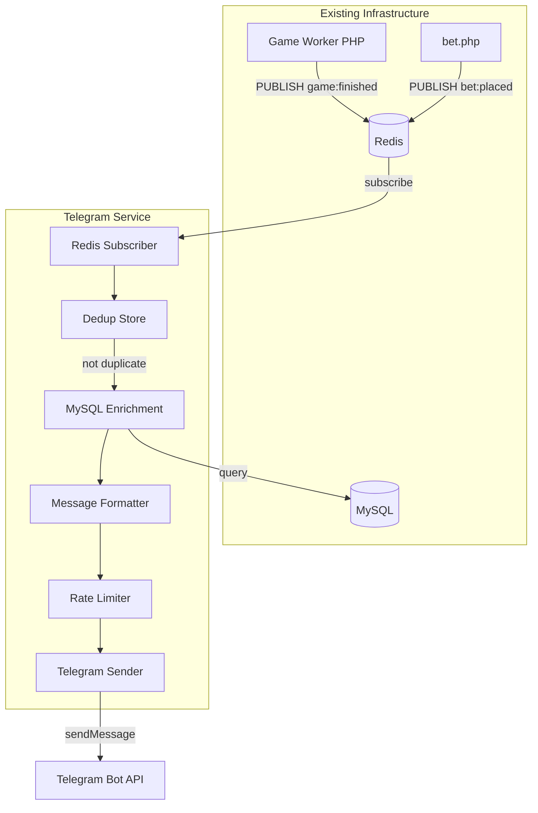
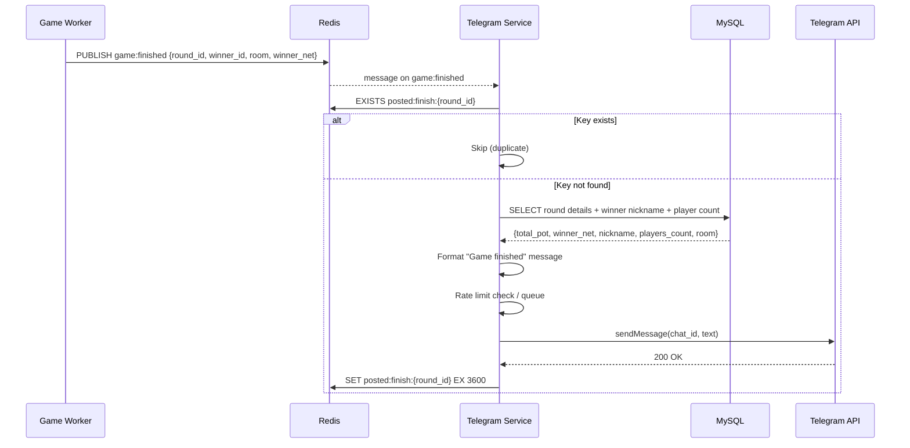
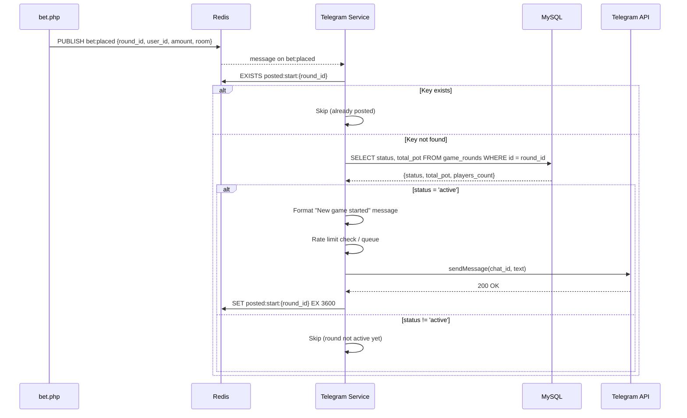

# Design Document: Telegram Autopost Service

## Overview

A standalone Node.js microservice (`telegram/server.js`) that subscribes to Redis Pub/Sub channels `game:finished` and `bet:placed`, enriches events with MySQL data, and posts formatted messages to a Telegram channel via the Bot API. The service runs as a Docker container in the existing `docker-compose.yml` stack, reusing the same Redis and MySQL instances.

The design follows the same patterns as `websocket/server.js` — plain JavaScript (no TypeScript), `ioredis` for Redis, environment-based config, and graceful shutdown on SIGTERM/SIGINT.

### Key Design Decisions

1. **Two Redis connections**: one dedicated to Pub/Sub (ioredis subscriber mode), one for deduplication SET/GET operations. This is required because ioredis enters subscriber mode and cannot run regular commands on the same connection.
2. **mysql2 connection pool** (max 5 connections) for data enrichment queries, matching the existing DB credentials from `.env`.
3. **In-memory sliding window rate limiter** — no external dependencies, tracks timestamps of sent messages in a circular buffer. Simpler than token bucket and sufficient for a single-instance service.
4. **Message queue with backpressure** — when rate-limited, messages are queued in memory and drained as the window allows. Queue is bounded (100 messages) to prevent unbounded memory growth.
5. **No changes to existing codebase** — the service is purely additive (new files + docker-compose entry).

## Architecture



### Event Flow: game:finished



### Event Flow: bet:placed (New Game Started)



## Components and Interfaces

### File Structure

```
telegram/
├── package.json
├── server.js          # Entry point: startup, shutdown, event routing
├── lib/
│   ├── config.js      # ENV validation, exports config object
│   ├── logger.js      # Structured JSON logger (stdout)
│   ├── redis.js       # Redis subscriber + dedup client
│   ├── mysql.js       # mysql2 connection pool
│   ├── telegram.js    # Telegram API sender + rate limiter + retry
│   └── formatter.js   # Message templates
docker/telegram/
└── Dockerfile
```

### config.js

Reads and validates environment variables at startup. Exports a frozen config object.

```js
// Required ENV vars (exit 1 if missing):
//   TELEGRAM_BOT_TOKEN, TELEGRAM_CHAT_ID
//
// Optional with defaults:
//   TELEGRAM_RATE_LIMIT = 20
//   REDIS_HOST = 'redis', REDIS_PORT = 6379, REDIS_PASSWORD = ''
//   DB_WRITE_HOST = 'mysql', DB_USER, DB_PASS, DB_NAME
//   LOG_LEVEL = 'info'

module.exports = Object.freeze({
  telegram: { botToken, chatId, rateLimit },
  redis:    { host, port, password },
  db:       { host, user, password, database },
  logLevel,
});
```

### logger.js

Structured JSON logger matching the platform format (`timestamp`, `level`, `message`, `context`). Writes to `process.stdout`. Supports levels: `debug`, `info`, `warning`, `error`.

```js
// Interface:
log.info(message, context)    // { timestamp, level: 'info', message, context }
log.warning(message, context)
log.error(message, context)
log.debug(message, context)
```

### redis.js

Manages two ioredis connections:

1. **subscriber** — enters Pub/Sub mode, subscribes to `game:finished` and `bet:placed`.
2. **client** — regular connection for dedup SET/EXISTS operations.

```js
// Interface:
createSubscriber(config)       → { subscriber, client }
isDuplicate(key)               → Promise<boolean>
markSent(key, ttlSeconds)      → Promise<void>
shutdown()                     → Promise<void>
```

Reconnection: ioredis has built-in `retryStrategy`. We configure exponential backoff: `Math.min(times * 1000, 30000)`.

### mysql.js

Creates a `mysql2` connection pool (max 5 connections). Exports query helpers.

```js
// Interface:
createPool(config)             → pool
fetchRoundDetails(pool, roundId) → Promise<{total_pot, winner_net, room, nickname, players_count} | null>
fetchRoundStatus(pool, roundId)  → Promise<{status, total_pot, room, players_count} | null>
shutdown(pool)                 → Promise<void>
```

**game:finished enrichment query:**
```sql
SELECT
  gr.total_pot,
  gr.winner_net,
  gr.room,
  COALESCE(u.nickname, CONCAT('Player_', SUBSTRING(u.email, 1, 3), '***')) AS winner_nickname,
  (SELECT COUNT(DISTINCT user_id) FROM game_bets WHERE round_id = gr.id) AS players_count
FROM game_rounds gr
LEFT JOIN users u ON u.id = gr.winner_id
WHERE gr.id = ?
```

**bet:placed status check query:**
```sql
SELECT
  gr.status,
  gr.total_pot,
  gr.room,
  (SELECT COUNT(DISTINCT user_id) FROM game_bets WHERE round_id = gr.id) AS players_count
FROM game_rounds gr
WHERE gr.id = ?
```

### formatter.js

Pure functions that take enriched data and return formatted message strings.

```js
// Interface:
formatGameFinished({ room, total_pot, players_count, winner_nickname, winner_net })
  → string

formatGameStarted({ room, total_pot, players_count })
  → string
```

Room display mapping: `1 → "$1"`, `10 → "$10"`, `100 → "$100"`.

### telegram.js

Handles sending messages to the Telegram Bot API with rate limiting and retry logic.

```js
// Interface:
createSender(config)           → sender
sender.send(text, metadata)    → Promise<void>
sender.validateBot()           → Promise<void>  // calls getMe at startup
sender.shutdown()              → Promise<void>  // drains queue, resolves pending
sender.pendingCount()          → number
```

**Rate Limiter** (sliding window):
- Maintains an array of timestamps for the last N sent messages.
- Before sending, removes timestamps older than 60 seconds.
- If `timestamps.length >= rateLimit`, calculates delay until the oldest timestamp expires.
- Queued messages are drained via `setTimeout`.

**Retry Logic:**
- On HTTP >= 400 (excluding 400, 403): retry up to 3 times with delays 1s, 2s, 4s.
- On HTTP 429: wait `retry_after` seconds from response body, then retry.
- On HTTP 400 or 403: log error, do not retry (config problem).
- After 3 failures: log error with round_id, status, body. Message is dropped.

### server.js (Entry Point)

Orchestrates startup, event routing, and shutdown.

```js
// Startup sequence:
// 1. Load and validate config (config.js)
// 2. Validate Telegram bot token (getMe)
// 3. Connect Redis subscriber + client
// 4. Create MySQL pool
// 5. Subscribe to game:finished, bet:placed
// 6. Log startup info
//
// Event routing:
// game:finished → dedup check → MySQL enrich → format → send
// bet:placed    → dedup check → MySQL status check → if active → format → send
//
// Shutdown (SIGTERM/SIGINT):
// 1. Unsubscribe from Redis Pub/Sub
// 2. Wait for in-flight Telegram requests (max 10s timeout)
// 3. Close Redis connections
// 4. Close MySQL pool
// 5. Exit 0
```

## Data Models

### Redis Pub/Sub Payloads (Existing — Read Only)

**game:finished** (published by `game_worker.php`):
```json
{
  "round_id": 123,
  "winner_id": 45,
  "room": 10,
  "winner_net": 8.50
}
```

**bet:placed** (published by `bet.php`):
```json
{
  "round_id": 123,
  "user_id": 45,
  "amount": 10.0,
  "room": 10
}
```

### Redis Deduplication Keys

| Key Pattern | TTL | Purpose |
|---|---|---|
| `posted:finish:{round_id}` | 3600s | Prevent duplicate game finished messages |
| `posted:start:{round_id}` | 3600s | Prevent duplicate new game started messages |

### MySQL Tables Used (Read Only)

| Table | Fields Used | Purpose |
|---|---|---|
| `game_rounds` | `id`, `status`, `total_pot`, `winner_id`, `winner_net`, `room` | Round details |
| `game_bets` | `round_id`, `user_id` | Player count (COUNT DISTINCT) |
| `users` | `id`, `nickname`, `email` | Winner display name |

### Environment Variables

| Variable | Required | Default | Description |
|---|---|---|---|
| `TELEGRAM_BOT_TOKEN` | Yes | — | Telegram Bot API token |
| `TELEGRAM_CHAT_ID` | Yes | — | Target Telegram channel/chat ID |
| `TELEGRAM_RATE_LIMIT` | No | `20` | Max messages per minute |
| `REDIS_HOST` | No | `redis` | Redis hostname |
| `REDIS_PORT` | No | `6379` | Redis port |
| `REDIS_PASSWORD` | No | `''` | Redis password |
| `DB_WRITE_HOST` | No | `mysql` | MySQL hostname |
| `DB_USER` | Yes | — | MySQL username |
| `DB_PASS` | Yes | — | MySQL password |
| `DB_NAME` | No | `anora` | MySQL database name |
| `LOG_LEVEL` | No | `info` | Minimum log level |

### Docker Compose Addition

```yaml
telegram:
  build:
    context: .
    dockerfile: docker/telegram/Dockerfile
  environment:
    TELEGRAM_BOT_TOKEN: ${TELEGRAM_BOT_TOKEN}
    TELEGRAM_CHAT_ID: ${TELEGRAM_CHAT_ID}
    TELEGRAM_RATE_LIMIT: ${TELEGRAM_RATE_LIMIT:-20}
    REDIS_HOST: ${REDIS_HOST}
    REDIS_PORT: ${REDIS_PORT}
    REDIS_PASSWORD: ${REDIS_PASSWORD}
    DB_WRITE_HOST: ${DB_WRITE_HOST}
    DB_USER: ${DB_USER}
    DB_PASS: ${DB_PASS}
    DB_NAME: ${DB_NAME}
    LOG_LEVEL: ${LOG_LEVEL}
  depends_on:
    mysql:
      condition: service_healthy
    redis:
      condition: service_healthy
  networks:
    - anora-network
  restart: unless-stopped
```


## Correctness Properties

*A property is a characteristic or behavior that should hold true across all valid executions of a system — essentially, a formal statement about what the system should do. Properties serve as the bridge between human-readable specifications and machine-verifiable correctness guarantees.*

### Property 1: Event payload parsing preserves all fields

*For any* valid `game:finished` payload (with `round_id`, `winner_id`, `room`, `winner_net`) or valid `bet:placed` payload (with `round_id`, `user_id`, `amount`, `room`), parsing the JSON string should produce an object containing all original field values unchanged. For any invalid JSON string, parsing should return null without throwing.

**Validates: Requirements 1.2, 1.3**

### Property 2: Redis reconnect backoff is bounded

*For any* retry attempt number N (1 ≤ N ≤ 1000), the computed reconnect delay should equal `min(N * 1000, 30000)` milliseconds — linearly increasing from 1 second and capped at 30 seconds.

**Validates: Requirements 1.4**

### Property 3: Formatted messages contain all required fields

*For any* valid round data object, `formatGameFinished` output should contain the room label, total_pot value, players_count, winner_nickname, winner_net value, and the URL `https://anora.bet`. Similarly, *for any* valid round data, `formatGameStarted` output should contain the room label, total_pot value, players_count, and the URL `https://anora.bet`. When nickname is null or empty, the output should never contain the literal string "null".

**Validates: Requirements 2.2, 2.5, 3.2**

### Property 4: Deduplication is idempotent

*For any* round_id string, after calling `markSent(key)`, subsequent calls to `isDuplicate(key)` should return `true`. Before any `markSent` call, `isDuplicate(key)` should return `false`. Calling `markSent` twice for the same key should not throw or change behavior.

**Validates: Requirements 3.3, 4.1, 4.2, 4.3**

### Property 5: Rate limiter never exceeds configured limit

*For any* sequence of N message send attempts (N > rateLimit), at most `rateLimit` messages should be sent within any 60-second sliding window. Messages beyond the limit should be queued with a positive delay, not dropped.

**Validates: Requirements 5.1, 5.2**

### Property 6: Retry classification matches HTTP status rules

*For any* HTTP status code in the range [400, 599], the retry decision should follow: status 400 or 403 → no retry (0 attempts); status 429 → retry after `retry_after` seconds from response; all other 4xx/5xx → retry up to 3 times with exponential backoff (1s, 2s, 4s). Status codes < 400 should never trigger retry logic.

**Validates: Requirements 6.1, 6.3, 6.4**

### Property 7: Logger output is valid structured JSON

*For any* log level and any message string and context object, the logger output should be a valid JSON string containing at minimum the keys `timestamp`, `level`, `message`, and `context`. The `level` field should match the log method called. The `timestamp` should be a valid ISO 8601 string.

**Validates: Requirements 10.1**

### Property 8: Config validation rejects missing required variables

*For any* combination of environment variables where at least one of `TELEGRAM_BOT_TOKEN` or `TELEGRAM_CHAT_ID` is missing or empty, the config validator should throw an error. When all required variables are present and non-empty, validation should succeed and return a config object with correct values.

**Validates: Requirements 8.2, 11.1, 11.2**

## Error Handling

| Scenario | Behavior | Recovery |
|---|---|---|
| Redis Pub/Sub connection lost | ioredis auto-reconnects with backoff (1s → 30s cap) | Automatic; events during disconnect are lost (Pub/Sub is fire-and-forget) |
| Redis dedup check fails | Log warning, proceed with sending (avoid missing events) | Automatic; may cause rare duplicate |
| Invalid JSON in Pub/Sub message | Log error with raw message, discard | Automatic; no crash |
| MySQL query fails | Log error, skip this event | Automatic; message not sent |
| MySQL pool exhausted | Query waits for available connection (mysql2 built-in) | Automatic |
| Round not found in MySQL | Log warning, skip message | Automatic |
| Telegram API 400/403 | Log error, do not retry (config problem) | Manual: fix bot token or chat ID |
| Telegram API 429 | Wait `retry_after` seconds, then retry | Automatic |
| Telegram API 5xx / network error | Retry 3 times with exponential backoff (1s, 2s, 4s) | Automatic; log error after 3 failures |
| Rate limit reached | Queue message, send when window allows | Automatic; bounded queue (100 max) |
| Queue overflow (>100 messages) | Drop oldest message, log warning | Automatic; prevents memory leak |
| SIGTERM/SIGINT received | Stop accepting events, drain in-flight (10s timeout), close connections, exit 0 | Automatic |
| Config validation failure | Log error describing missing var, exit with code 1 | Manual: set required env vars |
| getMe validation failure | Log error, exit with code 1 | Manual: fix bot token |

## Testing Strategy

### Property-Based Testing

Library: **fast-check** (JavaScript property-based testing library for Node.js)

Each correctness property maps to a single property-based test with minimum 100 iterations. Tests are tagged with the design property they validate.

| Property | Test Description | Generator Strategy |
|---|---|---|
| P1: Event parsing | Generate random valid payloads (positive ints, floats, room ∈ {1,10,100}) and random invalid strings | `fc.record()` for valid payloads, `fc.string()` for invalid |
| P2: Reconnect backoff | Generate random retry counts 1–1000 | `fc.integer({min:1, max:1000})` |
| P3: Message formatting | Generate random round data (room ∈ {1,10,100}, positive floats, random nicknames including null/empty) | `fc.record()` with `fc.option(fc.string())` for nickname |
| P4: Deduplication | Generate random round_id strings | `fc.stringOf(fc.constantFrom(...digits))` |
| P5: Rate limiting | Generate sequences of send timestamps | `fc.array(fc.nat())` for inter-message delays |
| P6: Retry classification | Generate random HTTP status codes 400–599 | `fc.integer({min:400, max:599})` |
| P7: Logger output | Generate random log levels, messages, and context objects | `fc.string()`, `fc.dictionary()` |
| P8: Config validation | Generate random env var combinations with some required vars missing | `fc.record()` with `fc.option(fc.string())` |

### Unit Tests

Unit tests cover specific examples, edge cases, and integration points:

- **Formatter edge cases**: null nickname → masked output, zero pot, zero players
- **Dedup fallback**: Redis connection error → `isDuplicate` returns false (proceed with send)
- **Retry exhaustion**: 3 failures → error logged with round_id, status, body
- **429 handling**: specific retry_after value respected
- **Config**: specific missing var → correct error message
- **Startup logging**: verify log contains channel names and chat ID
- **Graceful shutdown**: verify connections closed in correct order

### Test Configuration

```json
{
  "testFramework": "node:test",
  "propertyLibrary": "fast-check",
  "minIterations": 100,
  "tagFormat": "Feature: telegram-autopost, Property {number}: {title}"
}
```

Each property test file should include a comment referencing the design property:
```js
// Feature: telegram-autopost, Property 1: Event payload parsing preserves all fields
```
